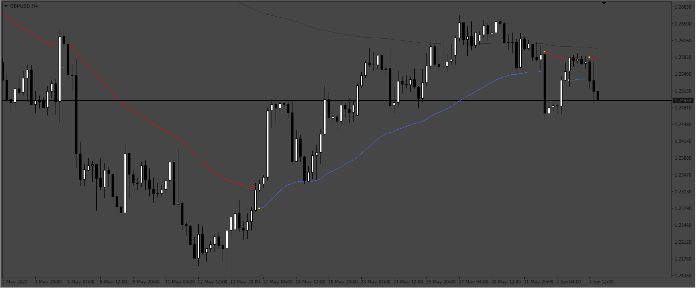

# #Pallada_AllAveragesBands

> Source: https://fxcodebase.com/code/viewtopic.php?f=38&t=72344  
> Forum: 38 · Topic 72344 · 1 post(s)

---

## #Pallada_AllAveragesBands

**Apprentice** · Mon Jun 06, 2022 9:24 am

Based on the request.
[https://fxcodebase.com/code/viewtopic.php?f=17&p=146202](https://fxcodebase.com/code/viewtopic.php?f=17&p=146202)

 [#Pallada_AllAveragesBands.mq4](files/146287/Pallada_AllAveragesBands.mq4)

You need to have the file "#Pallada_AllAveragesBands.ex4" in the folder "Indicators"

 [AllAverages.mq4](files/146287/AllAverages.mq4)
