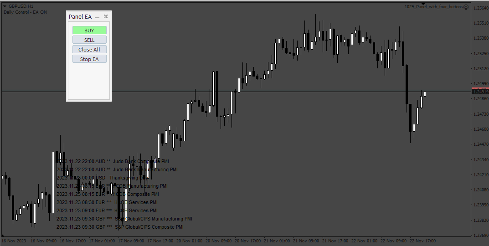
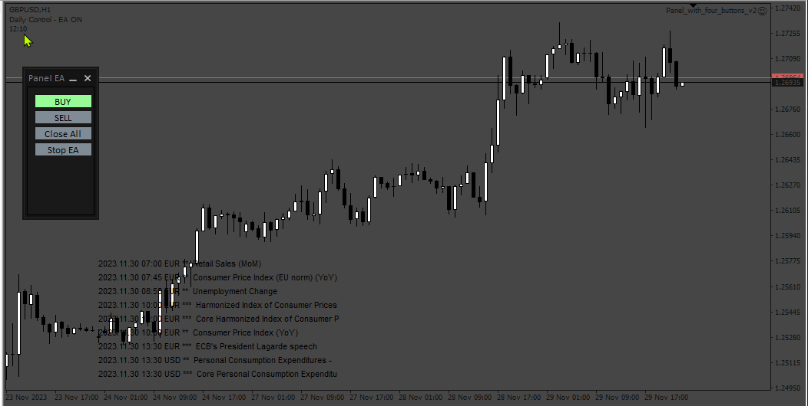

# Panel_with_four_buttons

> Source: https://fxcodebase.com/code/viewtopic.php?f=38&t=74365  
> Forum: 38 · Topic 74365 · 4 post(s)

---

## Panel_with_four_buttons

**Apprentice** · Fri Nov 24, 2023 3:46 am

Based on the request.
[https://fxcodebase.com/code/viewtopic.php?f=38&p=153334](https://fxcodebase.com/code/viewtopic.php?f=38&p=153334)

 [Panel_with_four_buttons.mq4](files/153396/Panel_with_four_buttons.mq4)

---

## Re: Panel_with_four_buttons

**Appu264** · Sun Nov 26, 2023 12:04 am

make v2 just change open trade per minute (true and false) with time changes
need indicator or add on EA local time show in chart (INDIAN TIMING) India Standard Time (IST)

SIR IF possible tradingview to mt4 COPY TRADE?

---

## Re: Panel_with_four_buttons

**Apprentice** · Tue Nov 28, 2023 9:32 am

We have added your request to the development list.
Development reference 1043

---

## Re: Panel_with_four_buttons

**Apprentice** · Thu Nov 30, 2023 2:07 pm

 [Panel_with_four_buttons_v2.mq4](files/153497/Panel_with_four_buttons_v2.mq4)
