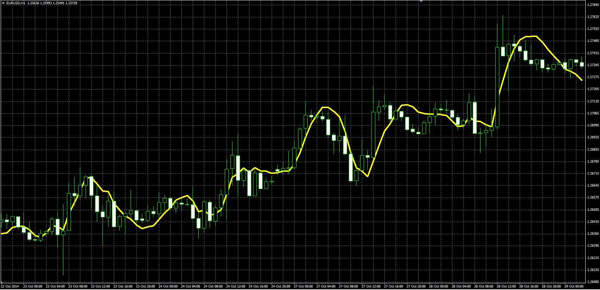
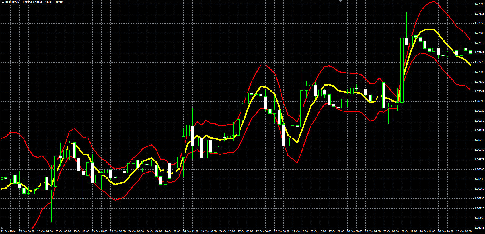

# Parabolic moving average and bands

> Source: https://fxcodebase.com/code/viewtopic.php?f=38&t=61501  
> Forum: 38 · Topic 61501 · 3 post(s)

---

## Parabolic moving average and bands

**Alexander.Gettinger** · Thu Nov 20, 2014 5:52 pm

Parabolic regression indicator (see [http://www.encyclopediaofmath.org/index ... regression](http://www.encyclopediaofmath.org/index.php/Parabolic_regression)).

The indicator produces the less lag than majority of other moving average indicators.

The algorithm is taken from V.P. Dyakonov. Reference book by the algorithms and programs on the Basic language for personal computers. M 1987.

**Parabolic MA:**

 

Download:

 [Par_MA.mq4](files/97239/Par_MA.mq4)

**Parabolic MA with bands:**

 

Download:

 [Par_MA_Bands.mq4](files/97239/Par_MA_Bands.mq4)

---

## Re: Parabolic moving average and bands

**Cactus** · Wed Jul 27, 2016 5:14 pm

Can you translate the parabolic MA with bands to .lua please?

---

## Re: Parabolic moving average and bands

**Apprentice** · Thu Jul 28, 2016 5:59 am

.lua version is available here.
[viewtopic.php?f=17&t=6718&p=15293&hilit=parabolic+MA#p15293](https://fxcodebase.com/code/viewtopic.php?f=17&t=6718&p=15293&hilit=parabolic+MA#p15293)
