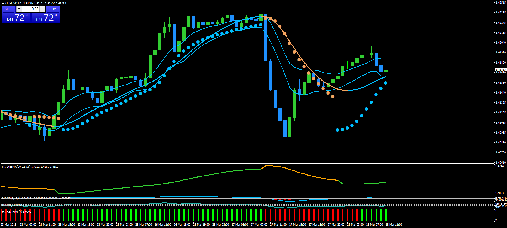

# Parabolic SAR

> Source: https://fxcodebase.com/code/viewtopic.php?f=38&t=65867  
> Forum: 38 · Topic 65867 · 1 post(s)

---

## Parabolic SAR

**bartwas1** · Wed Mar 28, 2018 5:34 am

Hi guys

This indicator is a version of parabolic SAR - different to the one built-in to meta trader 4. It seems less sensitive to less significant price movements, so it keeps the same direction longer. It isn't perfect, you still need to be aware of volatile market and news, but it looks very solid when showing direction.

Kind regards
Bart

 [Parabolic SAR of KAMA.mq4](files/118406/Parabolic%20SAR%20of%20KAMA.mq4)
