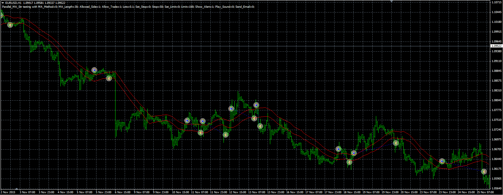

# Parallel MA strategy

> Source: https://fxcodebase.com/code/viewtopic.php?f=38&t=62980  
> Forum: 38 · Topic 62980 · 1 post(s)

---

## Parallel MA strategy

**Alexander.Gettinger** · Thu Dec 24, 2015 10:14 am

BUY condition.
Current price is up the MA on high price.

SELL condition.
Current price is down the MA on low price.

 

Download:

 [Parallel_MA_Str.mq4](files/103995/Parallel_MA_Str.mq4)
