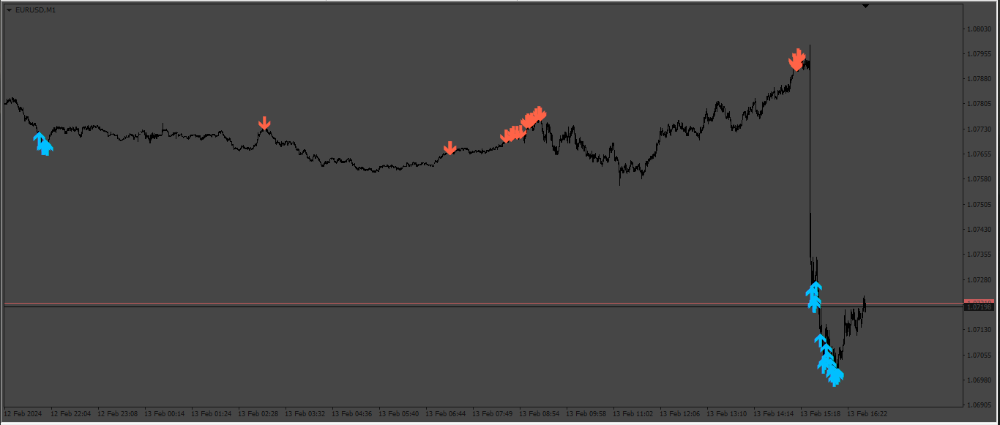

# PARSI

> Source: https://fxcodebase.com/code/viewtopic.php?f=38&t=74627  
> Forum: 38 · Topic 74627 · 9 post(s)

---

## PARSI

**Apprentice** · Sat Feb 17, 2024 11:42 am

Based on the request.
[https://fxcodebase.com/code/viewtopic.php?f=17&t=74614](https://fxcodebase.com/code/viewtopic.php?f=17&t=74614)

 [PARSI_v2.mq4](files/154417/PARSI_v2.mq4)

 [PARSI_v2.mq5](files/154417/PARSI_v2.mq5)

 [PARSI_v2_EA_v1.00.mq5](files/154417/PARSI_v2_EA_v1.00.mq5)

---

## Re: PARSI

**Oratilek11** · Sun Jul 28, 2024 5:22 am

Greetings, hope all is well, I was wondering if you could perhaps make an MT5 version of this Indicator.
Thank you in advance!

---

## Re: PARSI

**Oratilek11** · Tue Jul 30, 2024 3:48 pm

Could you please make an mt5 version of this indicator.

---

## Re: PARSI

**Apprentice** · Wed Jul 31, 2024 3:26 pm

We have added your request to the development list.
Development reference 620

---

## Re: PARSI

**Oratilek11** · Thu Aug 01, 2024 12:35 pm

Thank you very much and sorry for the other message ,i thought that my message didnt go through, my apologies.

---

## Re: PARSI

**[email protected]** · Thu Aug 01, 2024 6:22 pm

> **Apprentice wrote:**
> We have added your request to the development list.
> Development reference 620

Hi. Could you please make EA mt5 version for this indicator. MT5 Ea that open positions with Parsi indicator signals. Ea with Tp, Sl and trialing Stop. Thanks.

---

## Re: PARSI

**Apprentice** · Sun Sep 08, 2024 1:58 pm

MT5 version added.

---

## Re: PARSI

**Oratilek11** · Thu Dec 26, 2024 4:47 pm

> **Apprentice wrote:**
> MT5 version added.

Good day, thank you for creating the indicator but when i add it to the chart ,the arrows are all at the very bottom of the chart, no matter the currency pair or timeframe, could u please assist

---

## Re: PARSI

**Apprentice** · Mon Dec 30, 2024 7:47 pm

We have added your request to the development list.
Development reference 933
