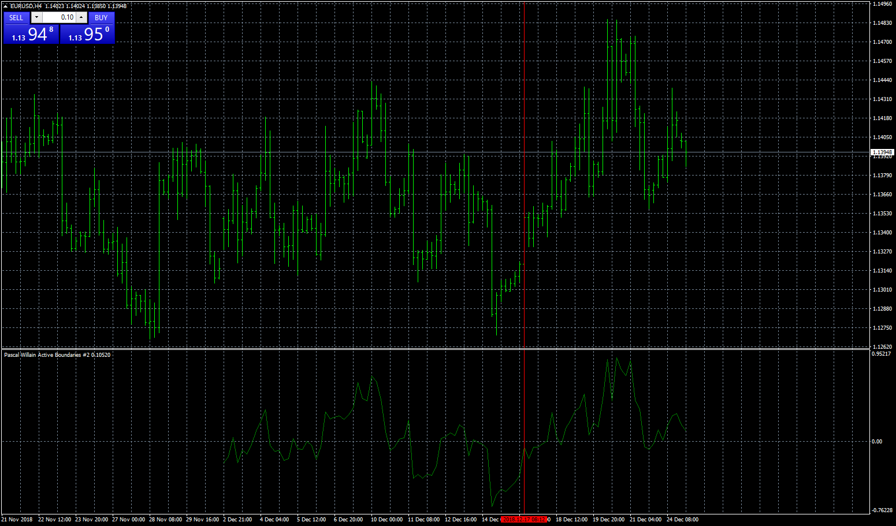

# Pascal Willain Active Boundaries

> Source: https://fxcodebase.com/code/viewtopic.php?f=38&t=67208  
> Forum: 38 · Topic 67208 · 2 post(s)

---

## Pascal Willain Active Boundaries

**Apprentice** · Wed Dec 26, 2018 6:11 am

Based on request.
[viewtopic.php?f=27&t=67196](https://fxcodebase.com/code/viewtopic.php?f=27&t=67196)

 [Pascal Willain Active Boundaries.mq4](files/123049/Pascal%20Willain%20Active%20Boundaries.mq4)

---

## Re: Pascal Willain Active Boundaries

**logicgate** · Wed Dec 26, 2018 7:01 am

Oh yeah, that is looking good!!!

THANKS!

You gotta read the book later to understand how to use Pascal's indis!
