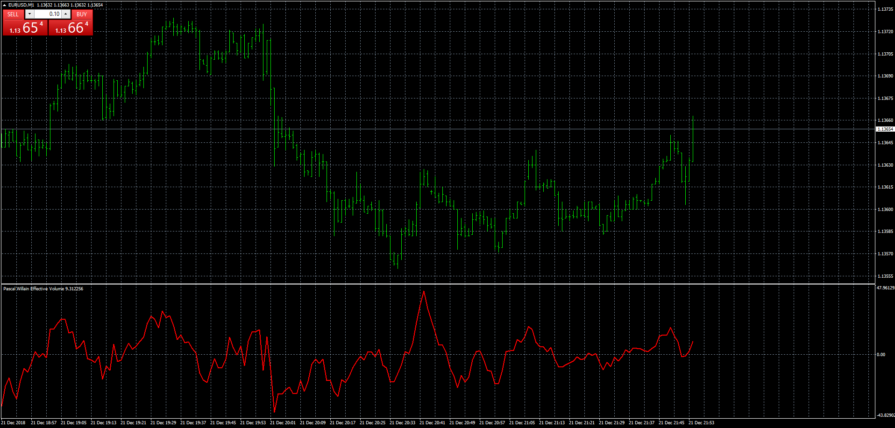
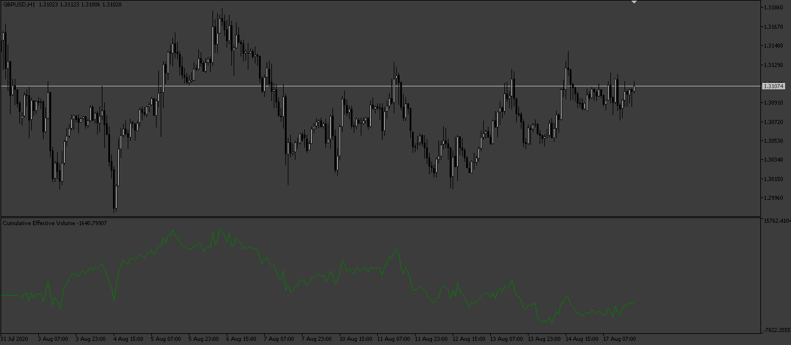
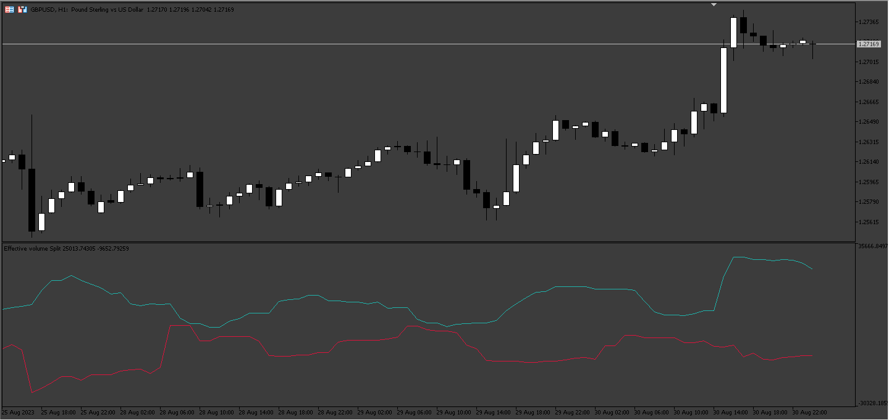
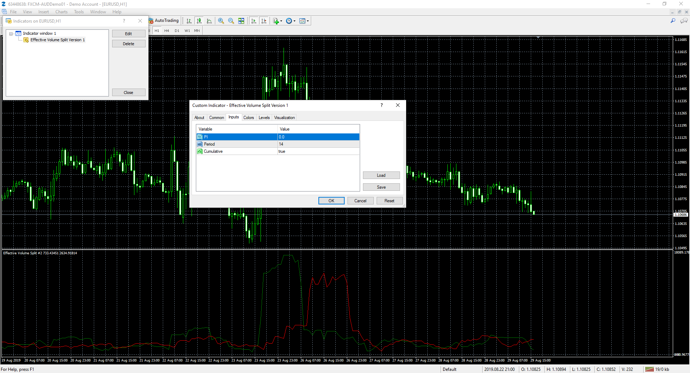
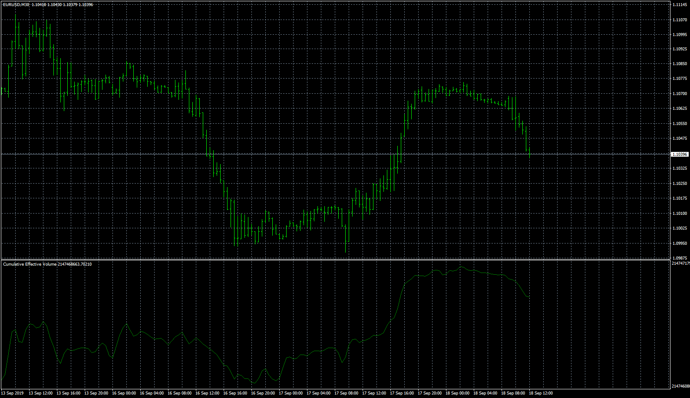

# Pascal Willain Effective Volume

> Source: https://fxcodebase.com/code/viewtopic.php?f=38&t=67194  
> Forum: 38 · Topic 67194 · 62 post(s)

---

## Pascal Willain Effective Volume

**Apprentice** · Sun Dec 23, 2018 7:02 am

 [Pascal Willain Effective Volume.mq4](files/123011/Pascal%20Willain%20Effective%20Volume.mq4)

 [Detrended Pascal Willain Effective Volume.mq4](files/123011/Detrended%20Pascal%20Willain%20Effective%20Volume.mq4)

 

 [Cumulative_Effective_Volume.mq5](files/123011/Cumulative_Effective_Volume.mq5)

 

 [Effective_Volume_Split.mq5](files/123011/Effective_Volume_Split.mq5)

TS2/Lua version
[viewtopic.php?f=17&t=67195](https://fxcodebase.com/code/viewtopic.php?f=17&t=67195)

---

## Re: Pascal Willain Effective Volume

**logicgate** · Sun Dec 23, 2018 8:14 am

Brilliant!!!!

---

## Re: Pascal Willain Effective Volume

**logicgate** · Sun Dec 23, 2018 9:18 am

I found the code for this indi where the guy says we worked with Pascal himself to create it, so I think it is worth taking a look to see if it's the same thing that in the one I posted and you updated it, perhaps it is more refined, who knows?

here it goes:

[http://www.ta-script.com/forum/viewtopi ... ive+volume](http://www.ta-script.com/forum/viewtopic.php?f=2&t=526&hilit=effective+volume)

---

## Re: Pascal Willain Effective Volume

**logicgate** · Sun Dec 23, 2018 1:24 pm

Another version of this that can be used in conjunction is called Effective Ratio.

It is the Large Players Effective Volume divided by the total volume. So you take only the LEV output from the indi (do not include the small players EV).

Effective Ratio = EMA(250)( LEV(i) / Volume(i) ) M1 charts

250 = one day

I think it would be better if we could choose the EMA period in the indi settings.

---

## Re: Pascal Willain Effective Volume

**logicgate** · Sun Dec 23, 2018 1:59 pm

You can have two versions of the Effective Volume Ratio.

The Large Effective Volume Ratio and the Total Effective Volume Ratio (which is the sum of large and small EV).

The LEV Ratio is used for buying.

The Total EV Ratio is used for shorting or exiting long position.

---

## Re: Pascal Willain Effective Volume

**Apprentice** · Mon Dec 24, 2018 6:27 am

AbsoluteValue option added.

---

## Re: Pascal Willain Effective Volume

**Apprentice** · Mon Dec 24, 2018 6:52 am

Your request is added to the development list under Id Number 4387

---

## Re: Pascal Willain Effective Volume

**Apprentice** · Tue Dec 25, 2018 8:00 am

Something like this.
Still have to revise it.

 [Effective Volume.mq4](files/123036/Effective%20Volume.mq4)

---

## Re: Pascal Willain Effective Volume

**logicgate** · Tue Dec 25, 2018 8:06 am

> **Apprentice wrote:**
> Something like this.
> Still have to revise it.
>
>
> Effective Volume.mq4

Is this the Ratio version?

---

## Re: Pascal Willain Effective Volume

**Apprentice** · Tue Dec 25, 2018 8:50 am

Summarized only.

---

## Re: Pascal Willain Effective Volume

**logicgate** · Thu Aug 15, 2019 11:25 pm

Hi there my friend. I am finally able now to test all indicators deeply as I returned home to my trading rig.

This indicator does not look like the one in Pascal book, it looks like you coded an oscillator, not a cumulative line. Also, the effective volume you posted last here:

[viewtopic.php?f=27&t=67236](https://fxcodebase.com/code/viewtopic.php?f=27&t=67236)

Does not look like the one in the book, also looking more of an weird oscillator, and there is something wrong as the lines plotted keep changing every couple of seconds, and did you use blue for the total effective volume?

Check here the pictures of the book and you will see how it is supposed to look like (first screenshot is total effective volume, which is Large + Small Effective Volume:

---

## Re: Pascal Willain Effective Volume

**Apprentice** · Fri Aug 16, 2019 8:27 am

Can you send code or and book to my email?
mario(.)jemic(@)gmail(.)com

---

## Re: Pascal Willain Effective Volume

**logicgate** · Fri Aug 16, 2019 1:19 pm

> **Apprentice wrote:**
> Can you send code or and book to my email?
> mario(.)jemic(@)gmail(.)com

Dear friend, I have sent you an email with the book attached, also a couple of links, one is an article that claims to have an implemented formula, Instructions in the email.

Cheers!

---

## Re: Pascal Willain Effective Volume

**Apprentice** · Sun Aug 18, 2019 8:44 am

Try this version.
[viewtopic.php?f=38&t=68807](https://fxcodebase.com/code/viewtopic.php?f=38&t=68807)

---

## Re: Pascal Willain Effective Volume

**logicgate** · Sun Aug 18, 2019 11:35 am

I did some more digging and I found a couple of indicators that you can take a look at the code.

I am attaching two ninjatrader indicators, both are effective volume total, it is not separated by large and small, but you can follow the instructions in the article and book to separate between large and small volume. Take a look.

The other two indis are MT4, one is called EVonlyLarge_2, it seems do be doing the trick, I just think that the smoothing period hard coded for it (if any) makes it too slow, have a look. The other is called EVindicator and looks like it has three lines (large, small and total), but it is not plotting correctly, looks like there is a scaling issue, but anyways worth looking at the code.

Also, I was thinking you could tweak the last effective volume you posted in your last post here:

[viewtopic.php?f=27&t=67236&hilit=+effective+ratio](https://fxcodebase.com/code/viewtopic.php?f=27&t=67236&hilit=+effective+ratio)

To make it plot a cumulative line (right now looks also like an oscillator), perhaps might solve it, it is worth a try too.

---

## Re: Pascal Willain Effective Volume

**logicgate** · Sun Aug 18, 2019 11:59 am

You have to compare the indicators to this formula here from the article, which they claim is better, but please read the article and chapter 1 of the book:

---

## Re: Pascal Willain Effective Volume

**logicgate** · Sun Aug 18, 2019 5:04 pm

The SPI parameter in the formula (0.01) perhaps in something better left for user input, I believe in forex for example isn´t this value gonna be lower? 0.0001 (1 pip) And in JPY pairs is gonna be different too.

---

## Re: Pascal Willain Effective Volume

**Apprentice** · Tue Aug 20, 2019 6:32 am

Modification based on article clip.

 [Cumulative Effective Volume.mq4](files/128061/Cumulative%20Effective%20Volume.mq4)

---

## Re: Pascal Willain Effective Volume

**logicgate** · Tue Aug 20, 2019 4:28 pm

> **Apprentice wrote:**
> Modification based on article clip.
>
>
> Cumulative Effective Volume.mq4

Dear friend this one is looking the best one so far! Now that you got it right, you have to split it in large and small effective volume. But we are interested only in the large effective volume. Follow the instructions on the article and the book on how to get the large effective volume, now that you got the total.

---

## Re: Pascal Willain Effective Volume

**Apprentice** · Wed Aug 21, 2019 5:03 am

Can you provide a reference for large and small effective volume?

---

## Re: Pascal Willain Effective Volume

**logicgate** · Wed Aug 21, 2019 2:04 pm

Large funds cannot move without leaving heavy footprints. One good relevant trace that we can find is in volume analysis, since we can assume that professional players need to place larger orders than retail players.

Even if hedge funds account for the lion's share of trading on the NYSE, we could still say that the majority of the trades (mainly small trades) originate from retail players. The simple difference is that hedge funds place larger orders than retail players (or a succession of mid-size orders). The consequence is that retail players make everything rather foggy when you look at all the data. What we therefore need is a reliable method to filter out the noise generated by retail players; we can then focus only on large players.

Using the Effective Volume Flow analysis model and separating the minute-by-minute volume by size allows filtering out such a noise. The filtering calculation is shown on Table 5 (separation size of 10,000 shares). The plotting of the LVS_VF (Large Volume Size Volume Flow) and the SVS_VF (Small Volume Size Volume Flow) results allows separating small from large players.

The separation of the effective volume flow analysis by volume size allows us to study possible divergences between price and volume patterns.

This method can be used in several instances:

A flat trading range will probably break in the direction of the LEVF.
A price uptrend with a negative LEVF indicates that problems lie ahead.
A price downtrend with a positive LEVF indicates that the downtrend is not sustainable.

**Check page 34 (50 via the pdf reader) of the book Value In Time that I sent you.**

According to Pascal, the best and most obvious way of to separate the volume between large and small is using the average separation method, as explained there.

---

## Re: Pascal Willain Effective Volume

**logicgate** · Wed Aug 21, 2019 3:43 pm

I noticed that the last bit of the first image I posted has a typo.

He meant "every minute having a volume **ABOVE** median volume" , we get the Large Effective Volume indicator.

---

## Re: Pascal Willain Effective Volume

**Apprentice** · Thu Aug 22, 2019 4:21 pm

Median as described here?
[https://en.wikipedia.org/wiki/Median](https://en.wikipedia.org/wiki/Median)

---

## Re: Pascal Willain Effective Volume

**logicgate** · Thu Aug 22, 2019 4:46 pm

> **Apprentice wrote:**
> Median as described here?
> [https://en.wikipedia.org/wiki/Median](https://en.wikipedia.org/wiki/Median)

Yes, it sounds exactly how it was described in the first image I attached here.

---

## Re: Pascal Willain Effective Volume

**logicgate** · Thu Aug 22, 2019 10:03 pm

Hi there dear friend, I was testing the indicator here in a simulator and it is showing a weird behavior. I still have to check live if this happens, gonna leave a chart running the whole day. But in the simulator, after a while the indicator stops plotting. Then, if I delete the indicator and load it again, it catches up with price.

---

## Re: Pascal Willain Effective Volume

**logicgate** · Tue Aug 27, 2019 2:03 pm

Hi there my friend, do you know why this indicator is lagging behind the price by a lot of bars?? Almost 3 hours behind price. Can you correct that? I was giving it a go again, I left it loaded on a chart, I noticed that after a couple of minutes it starts to stabilize and gives a decent reading. Perhaps you could update the formula using that one from the article ([viewtopic.php?p=128002#p128002](http://www.fxcodebase.com/code/viewtopic.php?p=128002#p128002))? And given that this one has the Large and Total EV, you can now code the Large And Total Effective Ratio. Large Effective Ratio is the LEV divided by total volume, and Total Effective Ratio is the TEV divided by total volume.

Large Effective Ratio = EMA(250)( LEV(i) / Volume(i) ) M1 charts

Total Effective Ratio = EMA(250)( TEV(i) / Volume(i) ) M1 charts

250 = one day

---

## Re: Pascal Willain Effective Volume

**Apprentice** · Wed Aug 28, 2019 2:44 pm

Based on Cumulative Effective Volume.mq4, median split added.

 [Effective Volume Split Version 1.mq4](files/128267/Effective%20Volume%20Split%20Version%201.mq4)

 [Effective Volume Split Version 2.mq4](files/128267/Effective%20Volume%20Split%20Version%202.mq4)

---

## Re: Pascal Willain Effective Volume

**logicgate** · Wed Aug 28, 2019 4:42 pm

Hi there my friend, thanks.

What is the difference between the two versions?

Is it split in large and small?

Large is the red by the looks of it. The indicator does not plot anything with the setting of PI = 0. The best settings I could find that gave a decent reading were period 50 and PI 0.00001, but this is taking a toll on the computer, I can hear even the cpu fan speed going up.

Also, there is no need to plot the small effective volume (if the other IS the small, I don´t know), we don´t care about it.

What we are interested in is the Large and Total. So, what the indicator have to show us is the Large effective volume line and the Total effective volume line (large + small). Then with those values you can code the effective ratio.

---

## Re: Pascal Willain Effective Volume

**logicgate** · Wed Aug 28, 2019 5:21 pm

Alright, I know what happened. I was loading the indicator on my MT4 installation which I run the simulators, when I loaded it on a chart that had history data converted from tick data via script, then it would not work on PI 0, just with those settings I posted in previous post.

Now I loaded on another installation which has the history generated via broker´s data and it is working with PI of 0. I looked at the code and it answered my question regarding what are the lines, but visually it does not seem right, the small effective volume is meaningless and it does not move price, only the large volume moves price. If you check the images of the book, you can see how the small volume always kind of stay flat and in a small range, and the large volume is the one that trends with price and give the divergence signals.

One more thing, I looked at the code now of the indicators, both cumulative effective volume and the last two you posted, and I noticed another thing that is wrong: you are telling the indicator to calculate using bars and no other instruction. If you had read chapter 1 of the book I sent you, you would have known that **the indicator needs 1 minute bars data to work properly**, you have to tell it to use ONLY 1 minute bar data in it´s calculation, in whatever timeframe it is loaded in.It is in 1 min timeframe that the activity is hidden and the separation of volume makes sense. On higher timeframes it is diluted.

---

## Re: Pascal Willain Effective Volume

**logicgate** · Wed Aug 28, 2019 5:36 pm

And now I discovered that the indicator does not plot anything if PI set to 0 if loaded on 1min or 5min timeframe, even using broker´s data.

---

## Re: Pascal Willain Effective Volume

**Apprentice** · Thu Aug 29, 2019 4:22 am

Have no problem with PI value 0.
Fix the rest.

---

## Re: Pascal Willain Effective Volume

**logicgate** · Thu Aug 29, 2019 8:25 am

Hi there my friend.

I have redownloaded the indis and they are not fixed. Or are you telling me to fix them? I am no coder, I don´t know how to change it so it is gonna use 1min timeframe data only.

I attached screenshots of 1m and 5m and you can see it does not plot, but the code still not correct:

---

## Re: Pascal Willain Effective Volume

**Apprentice** · Thu Aug 29, 2019 9:55 am

Click ok.

---

## Re: Pascal Willain Effective Volume

**logicgate** · Thu Aug 29, 2019 10:11 am

But of course I click ok.

Besides, your screenshot is of 1H timeframe, I am talking about the 1m e 5m timeframes.

---

## Re: Pascal Willain Effective Volume

**Apprentice** · Thu Aug 29, 2019 10:25 am

Try it now.

---

## Re: Pascal Willain Effective Volume

**logicgate** · Thu Aug 29, 2019 10:28 am

You updated the indicator of which posts?

---

## Re: Pascal Willain Effective Volume

**logicgate** · Thu Aug 29, 2019 10:30 am

And my friend, the indicator will not work properly if you don´t tell it to use specifically 1 minute timeframe data only on it´s calculation.

---

## Re: Pascal Willain Effective Volume

**logicgate** · Thu Aug 29, 2019 10:46 am

The first two images of this post:

[viewtopic.php?p=128096#p128096](http://www.fxcodebase.com/code/viewtopic.php?p=128096#p128096)

Shows you that you need the 1 minute data for effective volume. More specifically, the second image shows a table of the separation volume being calculated minute by minute. So it does not matter in which timeframe you load the effective volume indicators (5m, 15m, 30m, 1H, 4H, 1D), the calculation needs to be always be made using 1 minute timeframe.

---

## Re: Pascal Willain Effective Volume

**Apprentice** · Thu Aug 29, 2019 11:13 am

All. Try to use a different browser.

---

## Re: Pascal Willain Effective Volume

**logicgate** · Thu Aug 29, 2019 12:05 pm

Hi there my friend.

Downloaded the latest version, but you just fixed the problem of it not loading on 1m and 5m, it is still using the data from the timeframe it is loaded in, not 1 minute data. Until this is fixed, indicator will still not work properly.

I took a screenshot with old and latest version loaded, looks exactly the same.

Best regards.

---

## Re: Pascal Willain Effective Volume

**Apprentice** · Sun Sep 01, 2019 4:42 am

Your request is added to the development list.
 Internal developer reference 23.

---

## Re: Pascal Willain Effective Volume

**Apprentice** · Fri Sep 06, 2019 2:27 pm

[Effective Volume Split Version 1 LTF.mq4](files/128470/Effective%20Volume%20Split%20Version%201%20LTF.mq4)

 [Effective Volume Split Version 2 LTF.mq4](files/128470/Effective%20Volume%20Split%20Version%202%20LTF.mq4)

---

## Re: Pascal Willain Effective Volume

**logicgate** · Sat Sep 07, 2019 8:56 pm

Hi there buddy, thanks, looking good now using the 1min data on the higher timeframes, as it was supposed to be! Now you can code the Large Effective Ratio with the right output.

Large Effective Ratio is the Large Effective Volume (of the 1min) value divided by total volume:

**Large Effective Ratio = EMA(250)( LEV(i) / Volume(i) ) M1 charts**

Good to have an option of number of bars to calculate.

Now you can also fix the cumulative effective volume you posted here to use the 1M timeframe in it´s calculation:

[viewtopic.php?p=128061#p128061](http://www.fxcodebase.com/code/viewtopic.php?p=128061#p128061)

---

## Re: Pascal Willain Effective Volume

**Apprentice** · Tue Sep 10, 2019 8:06 am

Your request is added to the development list.
Development reference 62.

---

## Re: Pascal Willain Effective Volume

**Apprentice** · Thu Sep 12, 2019 6:42 am

Try this version.

 [Large Effective Ratio.mq4](files/128596/Large%20Effective%20Ratio.mq4)

---

## Re: Pascal Willain Effective Volume

**logicgate** · Thu Sep 12, 2019 8:39 am

Thanks buddy, gonna try it right now.

How are we on the 1minute Cumulative Effective Volume?

---

## Re: Pascal Willain Effective Volume

**logicgate** · Thu Sep 12, 2019 11:49 am

> **Apprentice wrote:**
> Try this version.
>
>
> Large Effective Ratio.mq4

In cumulative mode, the indicator makes MT4 very laggy and CPU intensive, it hangs for a couple of seconds than comes to normal, then hangs... Can´t use it like this.

---

## Re: Pascal Willain Effective Volume

**Apprentice** · Mon Sep 16, 2019 3:26 am

Effective Volume Split Version 1 LTF/Effective Volume Split Version 2 LTF are optimized.
They slowed down the LER.

---

## Re: Pascal Willain Effective Volume

**logicgate** · Mon Sep 16, 2019 8:10 am

Hi there. Just wanted to know if you are working on the Cumulative Effective Volume LTF

---

## Re: Pascal Willain Effective Volume

**Apprentice** · Wed Sep 18, 2019 6:44 am

How it will be calculated?

---

## Re: Pascal Willain Effective Volume

**logicgate** · Wed Sep 18, 2019 8:16 am

> **Apprentice wrote:**
> How it will be calculated?

Grab the latest cumulative effective volume you coded (**gonna attach to this post**), and just make it use the data from 1minute timeframe in it's calculation.

---

## Re: Pascal Willain Effective Volume

**Apprentice** · Mon Sep 23, 2019 5:59 am

Your request is added to the development list.
Development reference 118.

---

## Re: Pascal Willain Effective Volume

**aladdin007** · Mon Sep 23, 2019 9:13 am

can you modified this indicator to be histogram please , i have question there is any indicator can work like the vsa volumeter

thank you so mich MR aprrentice and mario

---

## Re: Pascal Willain Effective Volume

**logicgate** · Tue Sep 24, 2019 7:04 am

> **aladdin007 wrote:**
> can you modified this indicator to be histogram please , i have question there is any indicator can work like the vsa volumeter
>
> thank you so mich MR aprrentice and mario

[https://www.mql5.com/en/market/product/15939](https://www.mql5.com/en/market/product/15939)

---

## Re: Pascal Willain Effective Volume

**aladdin007** · Wed Sep 25, 2019 8:44 am

thank you so much Mr logicgate

---

## Re: Pascal Willain Effective Volume

**Apprentice** · Wed Oct 02, 2019 4:30 am

 [Cumulative_Effective_Volume_v1.2.mq4](files/128943/Cumulative_Effective_Volume_v1.2.mq4)

 [Effective_Volume_Split2_v1.1.mq4](files/128943/Effective_Volume_Split2_v1.1.mq4)

---

## Re: Pascal Willain Effective Volume

**logicgate** · Wed Oct 02, 2019 6:52 am

Thanks buddy, I have just tested and it is working perfectly!

---

## Re: Pascal Willain Effective Volume

**logicgate** · Mon Oct 07, 2019 8:16 am

Hi there my friend.

I have just confirmed that the Cumulative Effective Volume and the Effective Volume Split are making MT4 to freeze for a second or two every couple of seconds.

You can´t notice this when the market is closed and there are no ticks coming from the broker.

When market is open you can see that when you click and hold on the chart to drag it around it freezes for a second or two. It happens in an interval of a couple of seconds, like every 5 seconds MT4 freezes for 1 or 2 seconds. I narrowed it down to those two indicators. I delete all indicators and reloaded them and I could confirm.

---

## Re: Pascal Willain Effective Volume

**Apprentice** · Thu Oct 10, 2019 12:59 pm

Try Cumulative_Effective_Volume_v1.2.mq4 / Effective_Volume_Split2_v1.1.mq4

---

## Re: Pascal Willain Effective Volume

**xpf2003** · Fri Jul 28, 2023 2:16 am

Apologies for digging out an old thread but I was looking for MT5 versions of these indicators. Is it possible to get these converted to MT5 please?

---

## Re: Pascal Willain Effective Volume

**Apprentice** · Mon Jul 31, 2023 5:50 pm

We have added your request to the development list.
Development reference 663.

---

## Re: Pascal Willain Effective Volume

**Apprentice** · Fri Sep 01, 2023 5:35 am

MT5 version added.
