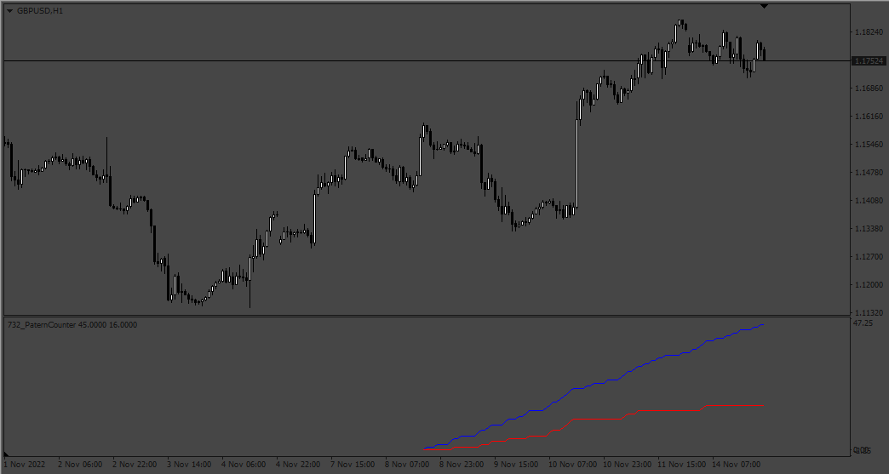

# PaternCounter

> Source: https://fxcodebase.com/code/viewtopic.php?f=38&t=72943  
> Forum: 38 · Topic 72943 · 2 post(s)

---

## PaternCounter

**Apprentice** · Mon Nov 14, 2022 4:34 pm

Based on the request.
[https://fxcodebase.com/code/viewtopic.p ... 65#p148265](https://fxcodebase.com/code/viewtopic.php?f=27&p=148265#p148265)

 [PaternCounter.mq4](files/148330/PaternCounter.mq4)

---

## Re: PaternCounter

**ronmcf** · Tue Nov 15, 2022 10:29 am

This is great! Thank you!
Is there any way to get the date displayed of when the 100 period started?
