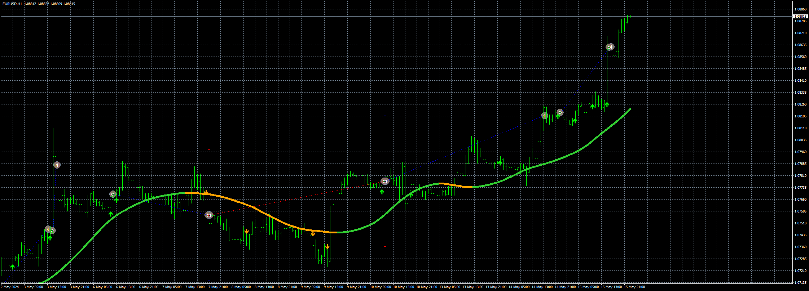
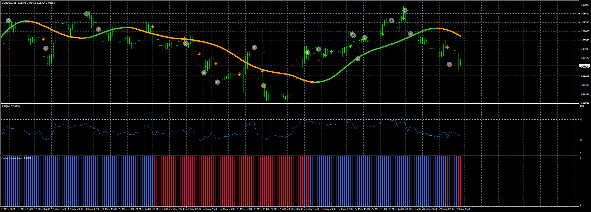

# PC_Signal_EA

> Source: https://fxcodebase.com/code/viewtopic.php?f=38&t=74871  
> Forum: 38 · Topic 74871 · 7 post(s)

---

## PC_Signal_EA

**Apprentice** · Wed May 15, 2024 3:13 pm

Based on the request.
[https://fxcodebase.com/code/viewtopic.php?f=17&t=74725](https://fxcodebase.com/code/viewtopic.php?f=17&t=74725)

 [PC Signal.ex4](files/155349/PC%20Signal.ex4)

 [PC_Signal_EA_v1.00.mq4](files/155349/PC_Signal_EA_v1.00.mq4)

---

## Re: PC_Signal_EA

**trtrader** · Wed May 15, 2024 3:45 pm

Could you please add a trailing stop with start, step, and distance? as well as BE.

Thanks

---

## Re: PC_Signal_EA

**Apprentice** · Fri May 17, 2024 4:19 pm

We have added your request to the development list.
Development reference 387

---

## Re: PC_Signal_EA

**trtrader** · Sat May 18, 2024 9:37 am

Great signals but can be much better.

its only opens 1 order at a time even though max orders 0 (meaning unlimited)

- For TP and SL would you please add:

-- SL, the lowest point of the candles before arrow (plus pips optional)
-- TP, Ratio of the stop loss X times (X optional)

- Add the attached indicator as a filter. Blue only allows sell, Red only allows buy.

- Add another optional mode of order entry. If true, when the line turns orange sell, Lime buy

- Take profit by RSI levels. When RSI crosses by default 30 from down to up for sell orders and from top to down 70 for buy orders.

- Add RSI filter. Dont open orders in extreme zones. by default 30 - 70

---

## Re: PC_Signal_EA

**Apprentice** · Wed May 22, 2024 2:00 pm

We have added your request to the development list.
Development reference 423

---

## Re: PC_Signal_EA

**Apprentice** · Wed May 22, 2024 2:41 pm

Task 387

 [PC_Signal_EA_v1.10.mq4](files/155456/PC_Signal_EA_v1.10.mq4)

---

## Re: PC_Signal_EA

**Apprentice** · Wed May 29, 2024 9:13 am

 [PC Signal.ex4](files/155556/PC%20Signal.ex4)

 [SuperTraderTrend.ex4](files/155556/SuperTraderTrend.ex4)

 [PC_Signal_EA_v1.20.mq4](files/155556/PC_Signal_EA_v1.20.mq4)
