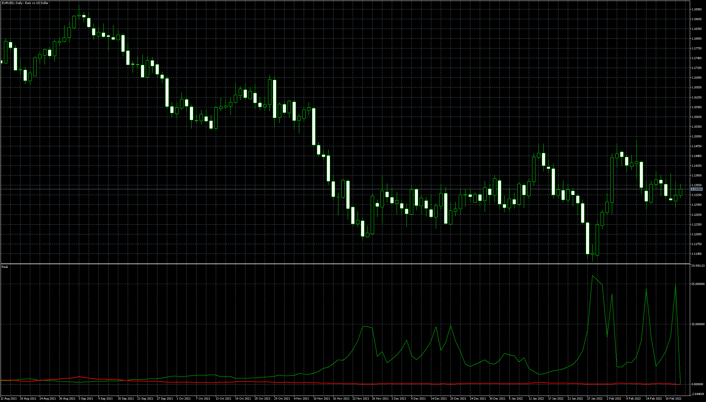

# Peak

> Source: https://fxcodebase.com/code/viewtopic.php?f=38&t=71913  
> Forum: 38 · Topic 71913 · 7 post(s)

---

## Peak

**Apprentice** · Wed Feb 23, 2022 7:51 am

Based on the request.
[https://fxcodebase.com/code/viewtopic.php?f=27&p=144970](https://fxcodebase.com/code/viewtopic.php?f=27&p=144970)

 [Peak.mq5](files/145143/Peak.mq5)

---

## Re: Peak

**logicgate** · Fri Feb 25, 2022 6:23 am

Will test it now buddy, thanks!

---

## Re: Peak

**logicgate** · Tue Mar 01, 2022 5:52 am

Dear friend Apprentice, do you think you can improve the code of this indi and make it stop repainting?

Any way to do it, or it´s impossible?

---

## Re: Peak

**Apprentice** · Wed Mar 02, 2022 10:09 am

Can shift it by one candle.
Will have more lag.

---

## Re: Peak

**logicgate** · Fri Mar 04, 2022 8:42 am

> **Apprentice wrote:**
> Can shift it by one candle.
> Will have more lag.

Sure, Let´s test it.

---

## Re: Peak

**logicgate** · Mon Mar 07, 2022 7:05 am

Hi there buddy, are you doing it? It´s just that you didn´t confirm.

---

## Re: Peak

**Apprentice** · Mon Mar 07, 2022 7:30 am

Your request is added to the development list.
Development reference 140.
