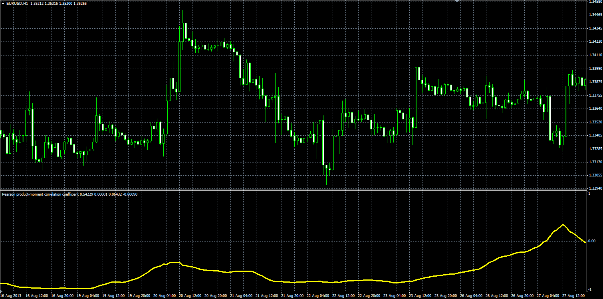

# Pearson product-moment correlation coefficient

> Source: https://fxcodebase.com/code/viewtopic.php?f=38&t=59584  
> Forum: 38 · Topic 59584 · 1 post(s)

---

## Pearson product-moment correlation coefficient

**Alexander.Gettinger** · Thu Sep 26, 2013 11:33 am

Original LUA indicator: [viewtopic.php?f=17&t=24131](https://fxcodebase.com/code/viewtopic.php?f=17&t=24131).

Formulas:
PPMCC = Numerator/Denominator, where
Numerator = MVA(AB),
Denominator = Sqrt(DenominatorC*DenominatorD),
DenominatorC = MVA(C),
DenominatorD = MVA(D),
AB = A*B,
C = A*A,
D = B*B,
A = Price(SymbolX)-MVA(SymbolX, PriceX, Length),
B = Price(SymbolY)-MVA(SymbolY, PriceY, Length).

 

Download:

 [PPMCC.mq4](files/89713/PPMCC.mq4)
