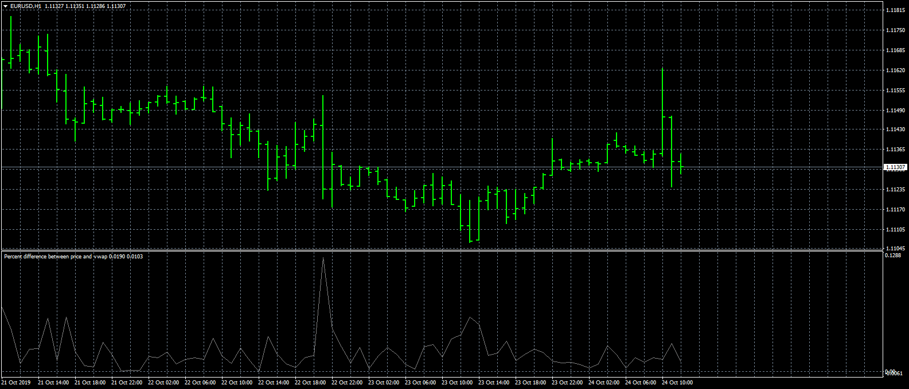

# Percent_difference_between_price_and_vwap

> Source: https://fxcodebase.com/code/viewtopic.php?f=38&t=69051  
> Forum: 38 · Topic 69051 · 2 post(s)

---

## Percent_difference_between_price_and_vwap

**Apprentice** · Thu Oct 24, 2019 6:18 am

Based on request.
[viewtopic.php?f=38&t=69048](https://fxcodebase.com/code/viewtopic.php?f=38&t=69048)

 [Percent_difference_between_price_and_vwap.mq4](files/129406/Percent_difference_between_price_and_vwap.mq4)

---

## Re: Percent_difference_between_price_and_vwap

**aladdin007** · Fri Nov 08, 2019 5:38 am

Good morning mr apprentice
You ready make this version and I did try it it’s not same showing on my request on trading view it’s not showing no bars no percentage........I did inform you that last week on message

Anyway thank you
