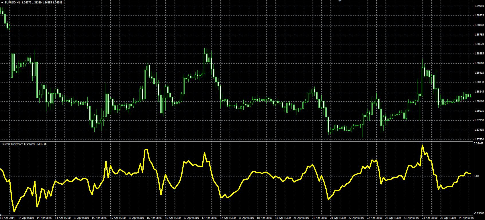

# Percent Difference Oscillator

> Source: https://fxcodebase.com/code/viewtopic.php?f=38&t=60800  
> Forum: 38 · Topic 60800 · 1 post(s)

---

## Percent Difference Oscillator

**Alexander.Gettinger** · Fri Jun 06, 2014 3:43 pm

Original LUA oscillator: [viewtopic.php?f=17&t=33488&p=56822](https://fxcodebase.com/code/viewtopic.php?f=17&t=33488&p=56822).

Formula:
PDO = 100*(Price-MA)/MA, where
MA = Moving average(Price, Length, Method).

 

Download:

 [PDO.mq4](files/94381/PDO.mq4)
