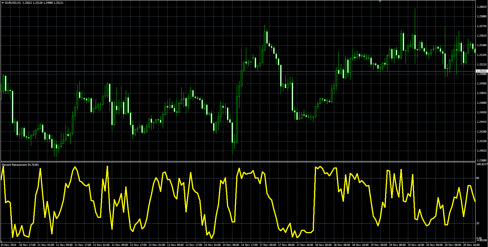

# Percent Retracement (PCR)

> Source: https://fxcodebase.com/code/viewtopic.php?f=38&t=61610  
> Forum: 38 · Topic 61610 · 1 post(s)

---

## Percent Retracement (PCR)

**Alexander.Gettinger** · Fri Dec 19, 2014 12:27 pm

Original LUA oscillator: [viewtopic.php?f=17&t=3448](https://fxcodebase.com/code/viewtopic.php?f=17&t=3448).

Formula:
PCR[i] = 100*(1-(Max+Close[i])/(Max-Min)), where
Min, Max - minimum and maximum prices at range from (i-Length+1) to (i).

 

Download:

 [PCR.mq4](files/97777/PCR.mq4)
