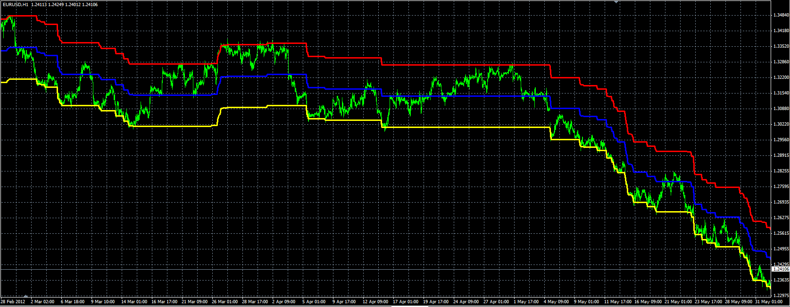

# Percentage crossover channel indicator

> Source: https://fxcodebase.com/code/viewtopic.php?f=38&t=19653  
> Forum: 38 · Topic 19653 · 1 post(s)

---

## Percentage crossover channel indicator

**Alexander.Gettinger** · Fri Jun 01, 2012 2:53 pm

Formulas:
Middle[i]=Price[i]*MinusValue if Price[i]*MinusValue>Middle[i-1],
Middle[i]=Price[i]*PlusValue if Price[i]*PlusValue<Middle[i-1],
else Middle[i]=Middle[i-1], where
PlusValue=1+Percent/100,
MinusValue=1-Percent/100.
Upper line=Middle*PlusValue,
Lower line=Middle*MinusValue;

 

Download:

 [Percentage_Crossover_Channel.mq4](files/34752/Percentage_Crossover_Channel.mq4)
