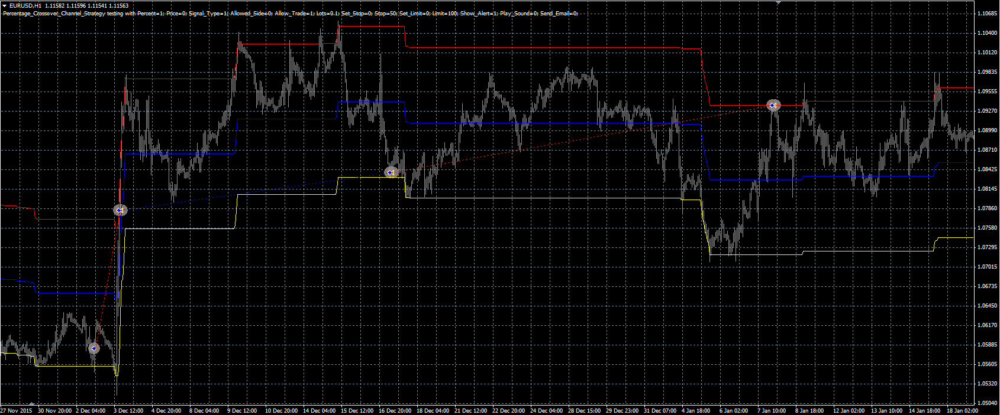

# Percentage crossover strategy

> Source: https://fxcodebase.com/code/viewtopic.php?f=38&t=63578  
> Forum: 38 · Topic 63578 · 1 post(s)

---

## Percentage crossover strategy

**Alexander.Gettinger** · Thu Jun 09, 2016 4:42 pm

The strategy based on the Percentage crossover channel indicator ([viewtopic.php?f=38&t=19653&p=34752](https://fxcodebase.com/code/viewtopic.php?f=38&t=19653&p=34752)).

 

Download:

 [Percentage_Crossover_Channel_Strategy.mq4](files/106696/Percentage_Crossover_Channel_Strategy.mq4)

The Percentage crossover channel indicator ([viewtopic.php?f=38&t=19653&p=34752](https://fxcodebase.com/code/viewtopic.php?f=38&t=19653&p=34752)) should be installed for correct work.
