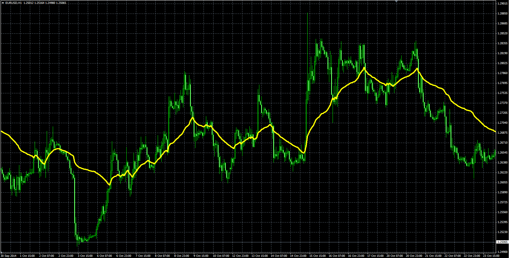
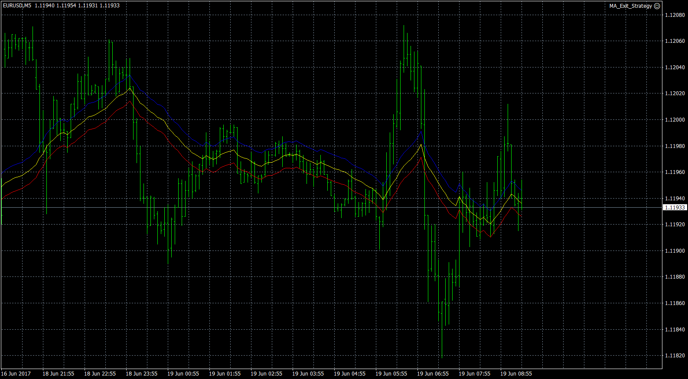
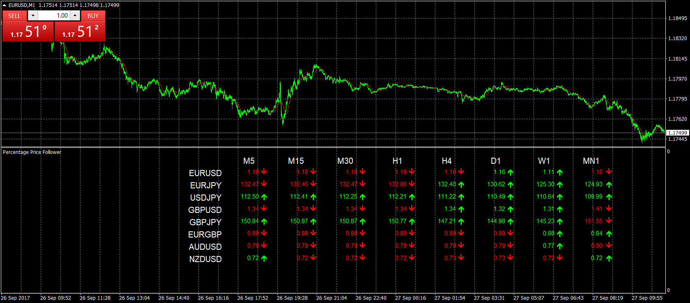

# Percentage Price Follower

> Source: https://fxcodebase.com/code/viewtopic.php?f=38&t=61628  
> Forum: 38 · Topic 61628 · 7 post(s)

---

## Percentage Price Follower

**Alexander.Gettinger** · Mon Dec 22, 2014 10:37 am

Original LUA indicator: [viewtopic.php?f=17&t=2801](https://fxcodebase.com/code/viewtopic.php?f=17&t=2801).

> There are two modes,
> One.
> The indicator follows the price, indicator is always trying to be equated with a price.
> Defined percentage of the High-Low Range is the maximum shift.
>
> Two
> The indicator follows the daily changes in price, in both directions,
> but only for a defined percentage of open - close Range.

 

Download:

 [Percentage_Price_Follower.mq4](files/97836/Percentage_Price_Follower.mq4)

 

Channel lines are aded X pip Up / Down from the Percentage_Price_Follower Line

 [Percentage_Price_Follower X Pips Channel.mq4](files/97836/Percentage_Price_Follower%20X%20Pips%20Channel.mq4)

 

Fow MTF_MCP_Percentage_price_follower.mq4 make sure to install Percentage_Price_Follower.mq4

 [MTF_MCP_Percentage_price_follower.mq4](files/97836/MTF_MCP_Percentage_price_follower.mq4)

---

## Re: Percentage Price Follower

**JADragon3** · Wed Sep 06, 2017 6:18 am

Hello. Would it be possible to add levels to this indicator ? Kind of turning it into a envelopes indicator ? I find that it has the potential to draw really nice price channels. And also , would you be willing to add Multi Time Frame function to it ? Please let me know.

( PS - I really love all the useful indicators that this website has produced. )

---

## Re: Percentage Price Follower

**Apprentice** · Wed Sep 06, 2017 8:28 am

Percentage_Price_Follower X Pips Channel.mq4 added.

---

## Re: Percentage Price Follower

**JADragon3** · Thu Sep 07, 2017 4:31 am

> **Apprentice wrote:**
> Percentage_Price_Follower X Pips Channel.mq4 added.

Thank you for the update. Is there any possibility of adding multi time frame function ?

---

## Re: Percentage Price Follower

**Apprentice** · Thu Sep 07, 2017 3:50 pm

Your request is added to the development list, Under Id Number 3887
 If someone is interested to do this task, please contact me.

---

## Re: Percentage Price Follower

**Apprentice** · Wed Sep 27, 2017 5:06 am

MTF_MCP_Percentage_price_follower.mq4 added.

---

## Re: Percentage Price Follower

**JADragon3** · Fri Oct 06, 2017 6:05 pm

> **Apprentice wrote:**
> MTF_MCP_Percentage_price_follower.mq4 added.

Thank you for the update. I am very interested in using this
