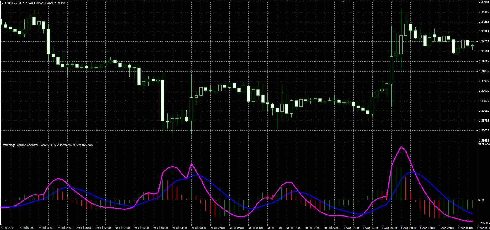

# Percentage Volume Oscillator (PVO)

> Source: https://fxcodebase.com/code/viewtopic.php?f=38&t=61248  
> Forum: 38 · Topic 61248 · 1 post(s)

---

## Percentage Volume Oscillator (PVO)

**Alexander.Gettinger** · Thu Sep 25, 2014 9:20 am

Original LUA oscillator: [viewtopic.php?f=17&t=27744](https://fxcodebase.com/code/viewtopic.php?f=17&t=27744).

Formulas:
PVO = ShortMA-LongMA, if Mode = Absolute,
PVO = (ShortMA-LongMA)/LongMA, if Mode = Relative,
Signal = MA(PVO) with [Signal_Length] number of periods and [Signal_Method] type,
Histogram = PVO-Signal, where
ShortMA = MA(Volume) with [Short_Length] number of periods and [Short_Method] type,
LongMA = MA(Volume) with [Long_Length] number of periods and [Long_Method] type.

 

Download:

 [PVO.mq4](files/96187/PVO.mq4)

TS2 version.
[viewtopic.php?f=17&t=27744](https://fxcodebase.com/code/viewtopic.php?f=17&t=27744)
