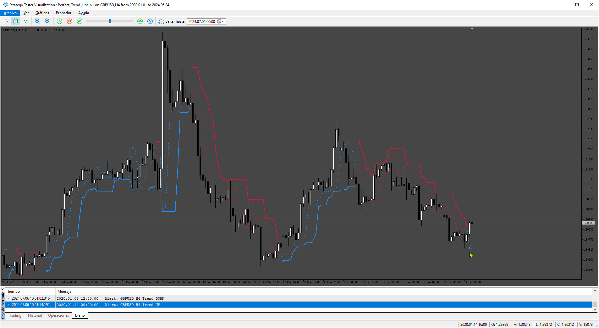
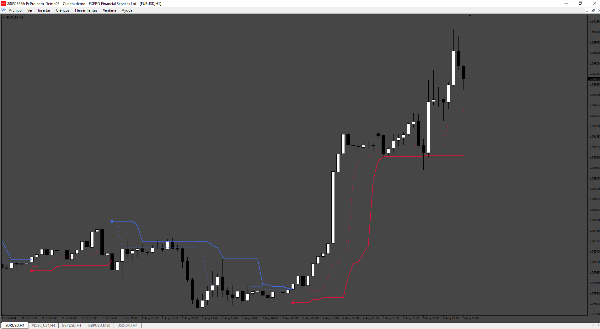
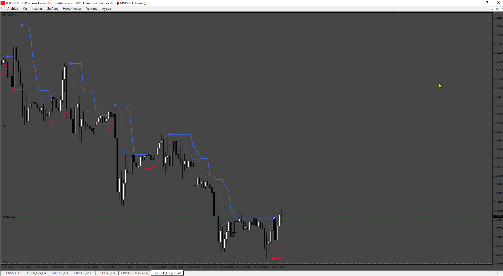

# Perfect_Trend_Line_v1

> Source: https://fxcodebase.com/code/viewtopic.php?f=38&t=75049  
> Forum: 38 · Topic 75049 · 9 post(s)

---

## Perfect_Trend_Line_v1

**Apprentice** · Tue Jul 09, 2024 2:12 pm

Based on the request.
[https://fxcodebase.com/code/viewtopic.p ... 75#p150875](https://fxcodebase.com/code/viewtopic.php?f=27&p=150875#p150875)

 [Perfect_Trend_Line_v1.mq5](files/156077/Perfect_Trend_Line_v1.mq5)

---

## Re: Perfect_Trend_Line_v1

**Emmybankz** · Tue Jul 16, 2024 11:16 am

Thanks

---

## Re: Perfect_Trend_Line_v1

**Emmybankz** · Thu Jul 18, 2024 6:10 am

Update for this no pop message and not Sound

---

## Re: Perfect_Trend_Line_v1

**Apprentice** · Thu Jul 18, 2024 3:22 pm

We have added your request to the development list.
Development reference 581

---

## Re: Perfect_Trend_Line_v1

**Apprentice** · Thu Jul 25, 2024 4:24 pm

Try this version.

 [Perfect_Trend_Line_v2.mq5](files/156230/Perfect_Trend_Line_v2.mq5)

---

## Re: Perfect_Trend_Line_v1

**trtrader** · Sun Jul 28, 2024 11:07 am

is it possible to get MT4 version EA?

Close:
- opposite signal

Stop loss:
- Highest or lowest point plus pips

Trailing options:
- start
- distance
- step

Take profit options

- RSI hit 70 or 30 by default.
- Highest or lowest point plus pips
- risk reward

---

## Re: Perfect_Trend_Line_v1

**Apprentice** · Wed Jul 31, 2024 3:37 pm

We have added your request to the development list.
Development reference 627

---

## Re: Perfect_Trend_Line_v1

**Apprentice** · Sat Aug 10, 2024 7:57 pm

 

 [Perfect_Trend_line.mq4](files/156388/Perfect_Trend_line.mq4)

 [Perfect_Trend_EA.mq4](files/156388/Perfect_Trend_EA.mq4)

---

## Re: Perfect_Trend_Line_v1

**Emmybankz** · Wed Nov 13, 2024 2:09 am

> **Apprentice wrote:**
> Try this version.
>
>
> Perfect_Trend_Line_v2.mq5

Thanks
