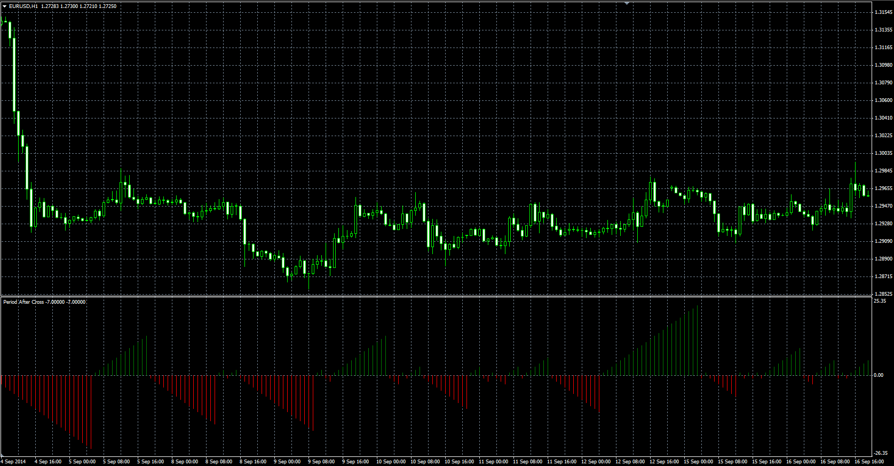

# Period After Cross oscillator

> Source: https://fxcodebase.com/code/viewtopic.php?f=38&t=61389  
> Forum: 38 · Topic 61389 · 1 post(s)

---

## Period After Cross oscillator

**Alexander.Gettinger** · Mon Oct 27, 2014 11:04 am

Original LUA oscillator: [viewtopic.php?f=17&t=23585](https://fxcodebase.com/code/viewtopic.php?f=17&t=23585).

Formula:
PAC[i] = PAC[i-1]+1, if Price[i]>MA[i] and Price[i-1]>MA[i-1],
PAC[i] = PAC[i-1]-1, if Price[i]<MA[i] and Price[i-1]<MA[i-1],
PAC[i] = 1, if Price[i]>MA[i],
PAC[i] = -1, if Price[i]<MA[i], where
MA - moving average with [Length] number of periods and [Method] type.

 

Download:

 [PAC.mq4](files/96767/PAC.mq4)
