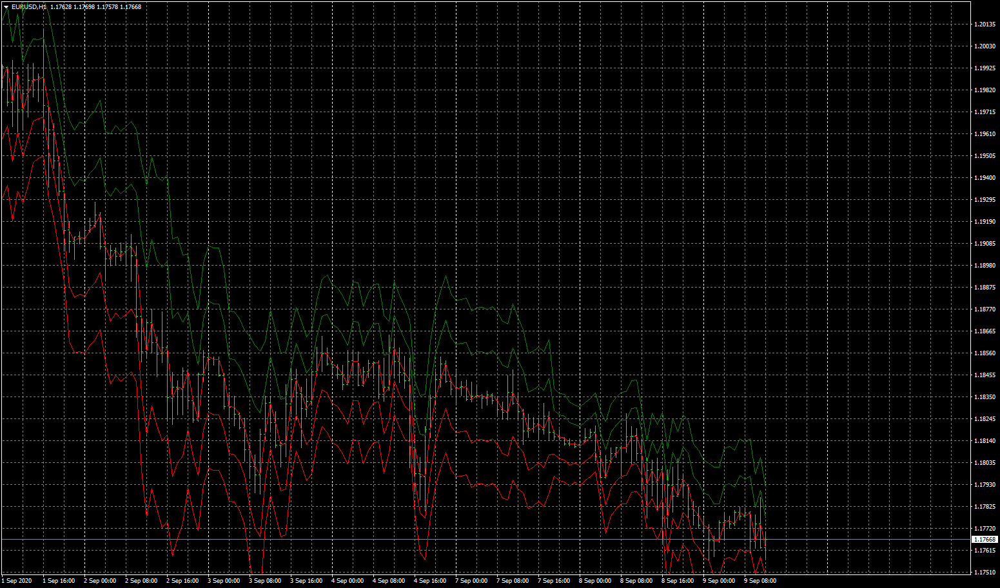

# Period Range Indicator Info EA

> Source: https://fxcodebase.com/code/viewtopic.php?f=38&t=70411  
> Forum: 38 · Topic 70411 · 12 post(s)

---

## Period Range Indicator Info EA

**Apprentice** · Wed Sep 09, 2020 4:44 am

TS2/Lua version.
[viewtopic.php?f=31&t=70328](https://fxcodebase.com/code/viewtopic.php?f=31&t=70328)

 [Period Range Indicator Info.mq4](files/137468/Period%20Range%20Indicator%20Info.mq4)

 [Period Range Indicator Info EA.mq4](files/137468/Period%20Range%20Indicator%20Info%20EA.mq4)

---

## Re: Period Range Indicator Info EA

**yolerap** · Wed Sep 23, 2020 6:34 am

Thank you,

Could you please add one filter ?

Use the Freescalperindicator please for the filter.

Thank you,

---

## Re: Period Range Indicator Info EA

**Apprentice** · Wed Sep 23, 2020 9:10 am

Your request is added to the development list.
Development reference 2094.

---

## Re: Period Range Indicator Info EA

**yolerap** · Wed Nov 04, 2020 2:35 pm

Hello,

Now you have translate the Freescalperindicator.mt4, is it possible to add the filter at the period range EA please ?

Link for the freescalperindicator : [viewtopic.php?f=38&t=70488&hilit=freescalper](https://fxcodebase.com/code/viewtopic.php?f=38&t=70488&hilit=freescalper)

Thank you,

---

## Re: Period Range Indicator Info EA

**Apprentice** · Thu Nov 05, 2020 3:40 am

Your request is added to the development list.
Development reference 2255.

---

## Re: Period Range Indicator Info EA

**Apprentice** · Fri Nov 06, 2020 3:32 am

[Period Range Indicator Info EA.mq4](files/138700/Period%20Range%20Indicator%20Info%20EA.mq4)

Try this version.

---

## Re: Period Range Indicator Info EA

**Apprentice** · Fri Dec 25, 2020 4:45 am

Task 2094
My MY4 refuses to load freescalperindicator.ex4
Can you provide MQ4 version?

---

## Re: Period Range Indicator Info EA

**yolerap** · Wed Dec 30, 2020 5:36 am

Here the file,

---

## Re: Period Range Indicator Info EA

**Apprentice** · Sat Jan 02, 2021 2:43 pm

Your request is added to the development list.
Development reference 5.

---

## Re: Period Range Indicator Info EA

**Apprentice** · Sun Jan 03, 2021 5:47 am

It's an expert, I need an indicator.
As I understand, ex4 need to be recompiled in order to work with modern versions of MT4.

---

## Re: Period Range Indicator Info EA

**yolerap** · Sun Jan 03, 2021 8:33 am

Sorry I don't have the MQL4 source, that's you created the indicator..

Link : [viewtopic.php?f=27&t=69751&start=40](https://fxcodebase.com/code/viewtopic.php?f=27&t=69751&start=40)

> **yolerap wrote:**
> I don't have the code sorry.. But it seems to be created by a Bollinger bands stop(deviations set to 2) made as histogram.
>
> I saw the SuperTrend is similar but less linear and smoothed.
>
> If you can't create the original strategy with the freescalper, is it possible to smooth more the SuperTrend?
>
> Thank you in advance.

---

## Re: Period Range Indicator Info EA

**yolerap** · Fri Nov 26, 2021 1:04 pm

Hello,

Is it possible to delete the DLL in this EA please ?
Version :
"Re: Period Range Indicator Info EA

Postby Apprentice » Fri Nov 06, 2020 3:32 am

Period Range Indicator Info EA.mq4
 (147.38 KiB) Downloaded 144 times

Try this version."

Thank you very much !
