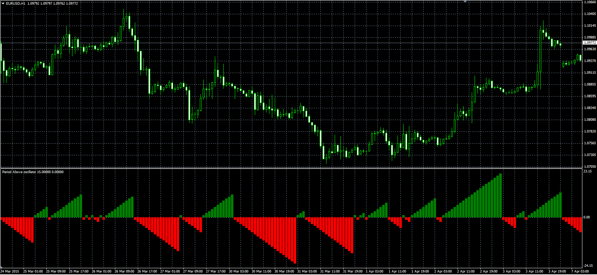

# Periods Above

> Source: https://fxcodebase.com/code/viewtopic.php?f=38&t=62164  
> Forum: 38 · Topic 62164 · 5 post(s)

---

## Periods Above

**Alexander.Gettinger** · Wed Apr 29, 2015 1:30 pm

Original LUA oscillator: [viewtopic.php?f=17&t=61114](https://fxcodebase.com/code/viewtopic.php?f=17&t=61114).

 

Download:

 [Period_Above.mq4](files/100151/Period_Above.mq4)

---

## Re: Periods Above

**GFTMATRIX** · Sat Jun 06, 2015 2:31 pm

Simple and Very good indicator . It will be better if the Alert and MA shift added with it . Hoping it will be updated ..

---

## Re: Periods Above

**Apprentice** · Sun Jun 07, 2015 3:02 am

Your request is added to the development list.

---

## Re: Periods Above

**GFTMATRIX** · Sun Jun 21, 2015 4:51 pm

Any update on my request pls

---

## Re: Periods Above

**Alexander.Gettinger** · Mon Dec 17, 2018 9:45 pm

Please try this version of the indicator:

 [Period_Above.mq4](files/122903/Period_Above.mq4)
