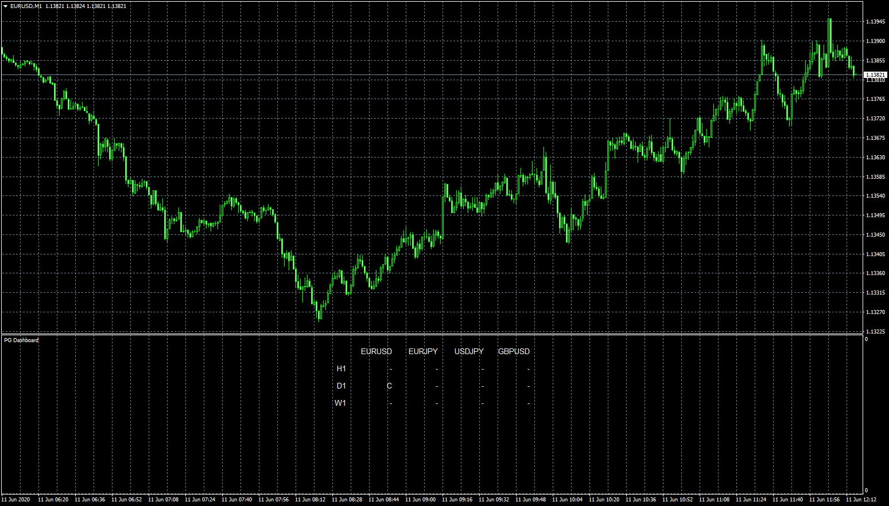

# PG Dashboard

> Source: https://fxcodebase.com/code/viewtopic.php?f=38&t=70002  
> Forum: 38 · Topic 70002 · 7 post(s)

---

## PG Dashboard

**Apprentice** · Thu Jun 11, 2020 6:06 am

 [PG Dashboard.mq4](files/134830/PG%20Dashboard.mq4)

 [PG.mq4](files/134830/PG.mq4)

---

## Re: PG Dashboard

**xmohammad** · Thu Jun 11, 2020 8:48 am

.

---

## Re: PG Dashboard

**xmohammad** · Thu Jun 11, 2020 9:11 am

I'm sorry, this dashboard doesn't show anything
it is empty
Fix request

---

## Re: PG Dashboard

**Apprentice** · Fri Jun 12, 2020 6:41 am

Redownload, and try to use a higher value for "Use lookback limit"

---

## Re: PG Dashboard

**xmohammad** · Fri Jun 12, 2020 1:43 pm

The display problem was solved.

But why don't the timers have Arrows?

It was requested that each time like M1/M5/M15/M30 H1 / H4 / D1

Have 2 Arrows instead of A&B = 18 Arrows
And a sign! Either $ or instead of a dot

More explanation:
The blue and red blocks indicate the long trend
 They are shown with the letter (A) in the picture, so they need a total of 9 arrows Instead of
M1 / M5 / M15 / M30 / H1 / H4 / D1 / W1 / MN

Silver blocks of color indicate a short trend and are indicated by the letter (B) in the image
They also need 9 arrows For eatch Time Frames Instead of them Next to the previous Arrows
And 9 characters for each white dot shown with the letter (C) in the image

Dear manager
This request and my other requests are used for algorithmic transactions in the form of an expert
So forgive me if it's a little complicated

---

## Re: PG Dashboard

**xmohammad** · Fri Jun 12, 2020 1:54 pm

like picture is gooooooood

---

## Re: PG Dashboard

**Apprentice** · Sun Jun 14, 2020 7:29 pm

Your request is added to the development list.
Development reference 1481.
