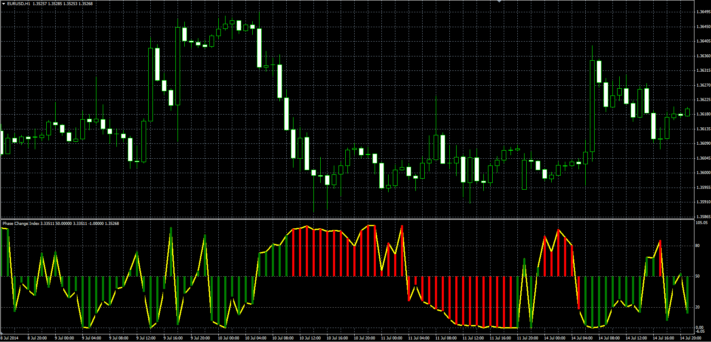

# Phase Change Index

> Source: https://fxcodebase.com/code/viewtopic.php?f=38&t=61050  
> Forum: 38 · Topic 61050 · 1 post(s)

---

## Phase Change Index

**Alexander.Gettinger** · Mon Aug 18, 2014 2:05 pm

Original LUA oscillator: [viewtopic.php?f=17&t=60141](https://fxcodebase.com/code/viewtopic.php?f=17&t=60141).

Formulas:
PCI = 100*Up/(Up+Dn), where
Up = Sum(Abs(Price[i-Length]-Gradient)), if Price[i-Length]>Gradient,
Dn = Sum(Abs(Price[i-Length]-Gradient)), if Price[i-Length]<Gradient,
Gradient[i] = Price[i-Length]+Momentum[i]*i,
Momentum[i] = (Price[i]-Price[i-Length+1])/Length.

 

Download:

 [PCI.mq4](files/95421/PCI.mq4)
