# Pinbar_Magic_EA

> Source: https://fxcodebase.com/code/viewtopic.php?f=38&t=74143  
> Forum: 38 · Topic 74143 · 30 post(s)

---

## Pinbar_Magic_EA

**Apprentice** · Mon Sep 11, 2023 4:35 am

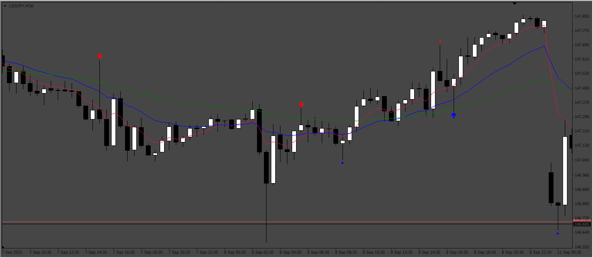

 

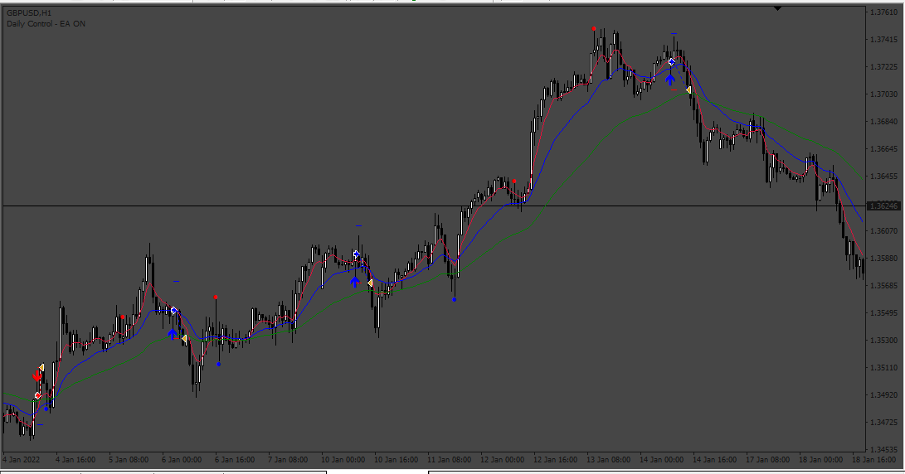

Based on request.
[https://fxcodebase.com/code/viewtopic.p ... 87#p152287](https://fxcodebase.com/code/viewtopic.php?f=27&p=152287#p152287)

 [Pinbar_Magic_Indicator.mq4](files/152496/Pinbar_Magic_Indicator.mq4)

 [Pinbar_Magic_EA.mq4](files/152496/Pinbar_Magic_EA.mq4)

 

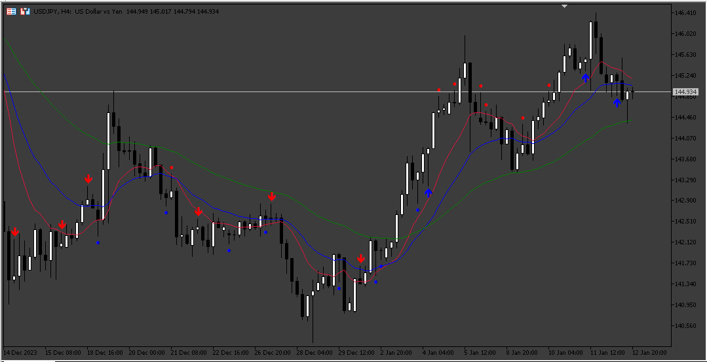

 

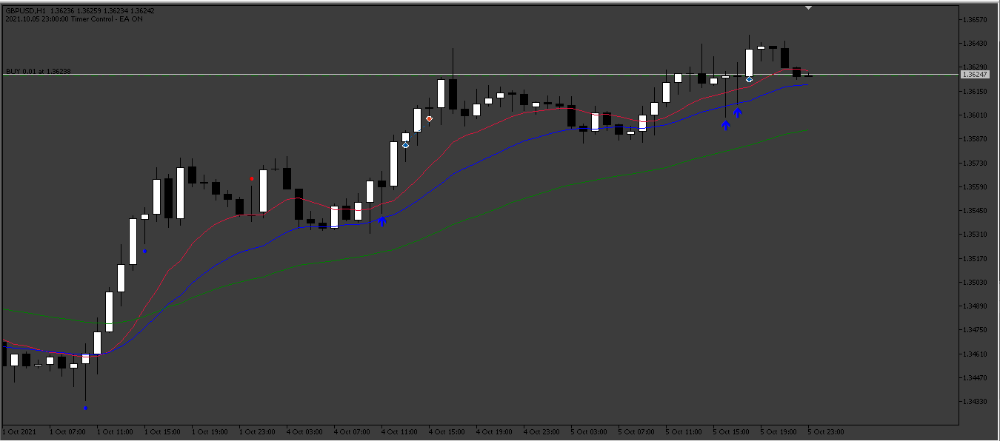

 [PinBar_Magic_Indicator.mq5](files/152496/PinBar_Magic_Indicator.mq5)

 [Pinbar_Magic_EA.mq5](files/152496/Pinbar_Magic_EA.mq5)

---

## Re: Pinbar_Magic_EA

**Friendweiser** · Thu Jan 04, 2024 10:50 am

Thank you for your hard work, could it be passible to create mt5 version?

---

## Re: Pinbar_Magic_EA

**Apprentice** · Wed Jan 10, 2024 7:31 am

We have added your request to the development list.
Development reference 52

---

## Re: Pinbar_Magic_EA

**Apprentice** · Sat Jan 13, 2024 2:41 pm

MT5 version added.

---

## Re: Pinbar_Magic_EA

**Friendweiser** · Thu Feb 22, 2024 2:40 pm

> **Apprentice wrote:**
> MT5 version added.

Hello sir thank you again for your hard work.
Just wondering when doing backtesting is all good, but on demo acc Im getting this and EA doesnt open trades

---

## Re: Pinbar_Magic_EA

**Apprentice** · Sat Feb 24, 2024 2:33 pm

We have added your request to the development list.
Development reference 178

---

## Re: Pinbar_Magic_EA

**Apprentice** · Sun Mar 03, 2024 7:24 am

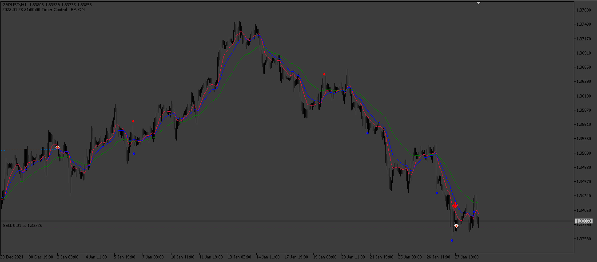

 

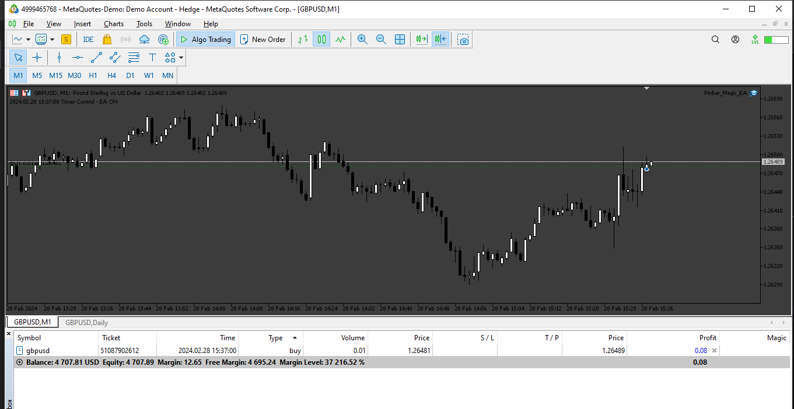

 [Pinbar_Magic_EA.mq5](files/154569/Pinbar_Magic_EA.mq5)

---

## Re: Pinbar_Magic_EA

**Friendweiser** · Tue Mar 19, 2024 1:20 pm

Hello again, big big thank you for your hard work, but something is wrong when I do backtesting trades happening like everyday, but testing on demo acc, it makes only one trade per week.

It has like 24 warnings, maybe thats the problem? If its possible to fix, would be really nice and again thank you for the work you do for us.

Best regards.

---

## Re: Pinbar_Magic_EA

**Apprentice** · Wed Mar 20, 2024 2:50 pm

We have added your request to the development list.
Development reference 237

---

## Re: Pinbar_Magic_EA

**ZeroMenthol** · Mon Mar 25, 2024 11:01 am

hi!

Can you add a Daily a Profit Goal in $ , so it will stop trading for the day and to resume next day,

Thank you!

---

## Re: Pinbar_Magic_EA

**ZeroMenthol** · Tue Mar 26, 2024 10:50 am

hi!

Can you add a feature this feature: if the EA have layered entries (2 or more entries), it will compute for a new TP wherein it will close all trades with an overall profit (preferably just minimum profit, barely just to get out of the drawdown) .

Thank you!

---

## Re: Pinbar_Magic_EA

**Apprentice** · Wed Mar 27, 2024 9:58 am

We have added your request to the development list.
Development reference 257

---

## Re: Pinbar_Magic_EA

**Apprentice** · Sat Mar 30, 2024 5:20 pm

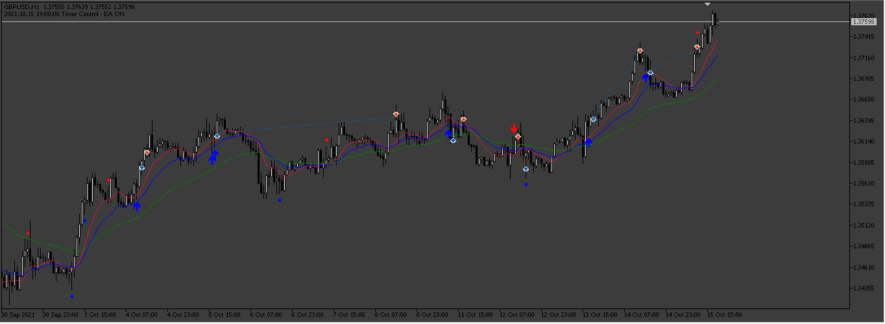

 [40418](files/154892/237_EARNNINGS.png)

 [Pinbar_Magic_EA_v2.mq5](files/154892/Pinbar_Magic_EA_v2.mq5)

---

## Re: Pinbar_Magic_EA

**Apprentice** · Sat Mar 30, 2024 5:34 pm

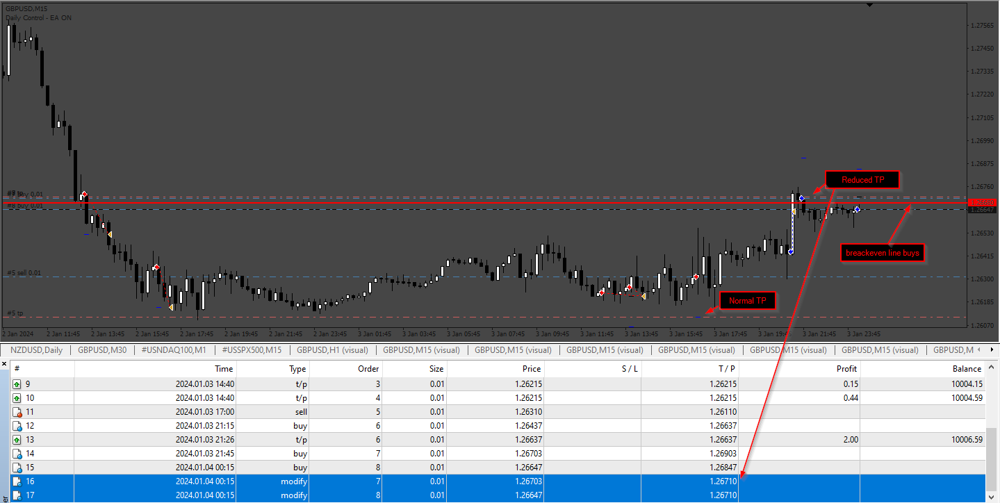

 [Pinbar_Magic_EA_v2.mq4](files/154896/Pinbar_Magic_EA_v2.mq4)

---

## Re: Pinbar_Magic_EA

**miyamotomusashi** · Tue Apr 02, 2024 6:16 pm

Hello apprentice, I truly appreciate your efforts in bringing this expert advisor to fruition. It's a fantastic idea. After testing it through backtesting, initially the expert advisor functions as it should. However, midway through, it encounters an out of memory issue, ultimately causing the expert advisor to cease working with the comment 'testing pass stopped due to critical error'. Could you please check into this issue? Thank you very much in advance.

---

## Re: Pinbar_Magic_EA

**ZeroMenthol** · Fri Apr 05, 2024 1:06 pm

hi!

Can you add a "Daily Profit Goal" in $ (currency) , so it will stop trading for the day once the goal has been reached and will resume next day around 0000 GMT

Thank you!

---

## Re: Pinbar_Magic_EA

**Apprentice** · Fri Apr 05, 2024 5:39 pm

We have added your request to the development list.
Development reference 278

---

## Re: Pinbar_Magic_EA

**ZeroMenthol** · Thu Apr 11, 2024 9:07 am

hi!

Trading Session dont seem to work, it opens trades 24 hrs a day even if I set the time filter to 00:00:00 to 07:00:00

---

## Re: Pinbar_Magic_EA

**Friendweiser** · Mon Jun 10, 2024 12:10 pm

> **Apprentice wrote:**
>
>
> 237.png
>
>
>
>
> 237_EARNNINGS.png
>
>
>
>
> Pinbar_Magic_EA_v2.mq5

Good day Sir, Could be possible to add trailing % ?
Start
Step
Stop

 or even there is more options for trailing stop?

Thank you.

---

## Re: Pinbar_Magic_EA

**Apprentice** · Wed Jun 12, 2024 3:12 pm

We have added your request to the development list.
Development reference 488

---

## Re: Pinbar_Magic_EA

**Apprentice** · Tue Jun 18, 2024 1:26 pm

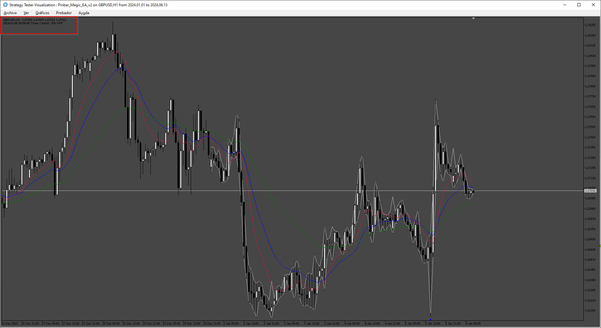

 

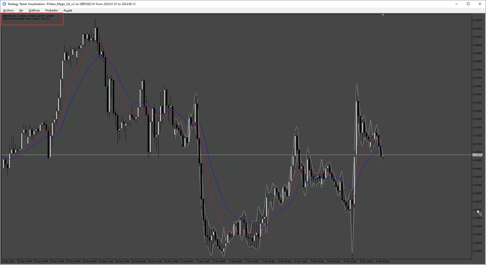

 [PinBar_Magic_Indicator.mq5](files/155801/PinBar_Magic_Indicator.mq5)

 [Pinbar_Magic_EA_v3.mq5](files/155801/Pinbar_Magic_EA_v3.mq5)

---

## Re: Pinbar_Magic_EA

**Friendweiser** · Fri Jul 05, 2024 1:01 pm

Good day Sir,
There is a problem with mt5 indicator, mt4 indicator works like a charm, please could you look at this and if its possible to fix it,

Thanks in advance.

---

## Re: Pinbar_Magic_EA

**Apprentice** · Sat Jul 13, 2024 2:19 am

We have added your request to the development list.
Development reference 578

---

## Re: Pinbar_Magic_EA

**Friendweiser** · Sun Jul 14, 2024 7:45 am

> **Friendweiser wrote:**
> Good day Sir,
> There is a problem with mt5 indicator, mt4 indicator works like a charm, please could you look at this and if its possible to fix it,
>
> Thanks in advance.

Just found out, it might help, when loading xau/usd xxx.xx chart it works fine, but when broker has xxx.xxx then indicator goes crazy like I showed.

Edited: Its happening the same after a while with different brokers and different digits

---

## Re: Pinbar_Magic_EA

**Friendweiser** · Mon Jul 29, 2024 12:52 pm

Hello Sir,
Are you still looking at the indicator issue?

---

## Re: Pinbar_Magic_EA

**Apprentice** · Mon Aug 12, 2024 2:57 pm

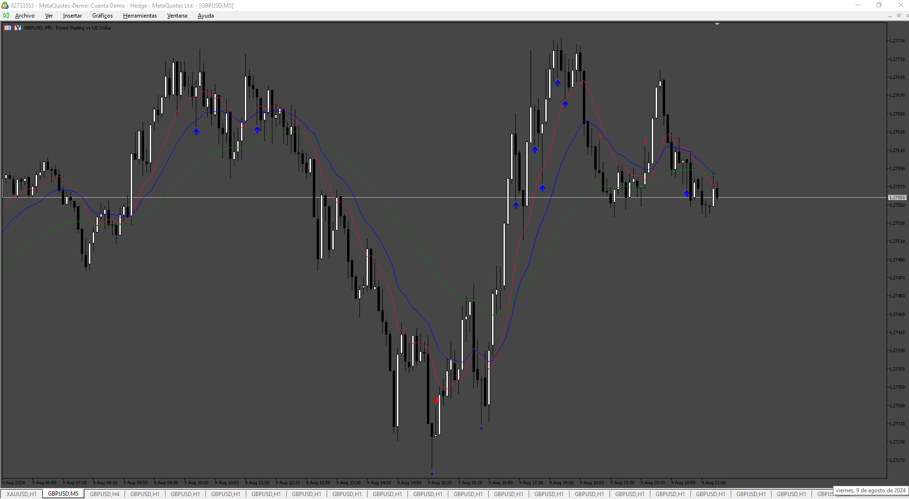

 [PinBar_Magic_Indicator.mq5](files/156409/PinBar_Magic_Indicator.mq5)

 [Pinbar_Magic_EA_v3.mq5](files/156409/Pinbar_Magic_EA_v3.mq5)

---

## Re: Pinbar_Magic_EA

**Friendweiser** · Tue Oct 08, 2024 11:55 am

Good Day Sir,

Just wondering if possible to update tsl, for example when open trade tsl will start work after x (5s 30s or300s) seconds, it would be like ping or delay for TSL(never seen before), this would help for scalping. If you need more info please ask me

Thank in advance.

---

## Re: Pinbar_Magic_EA

**Apprentice** · Wed Oct 09, 2024 12:26 pm

We have added your request to the development list.
Development reference 771

---

## Re: Pinbar_Magic_EA

**Apprentice** · Sat Oct 12, 2024 12:00 pm

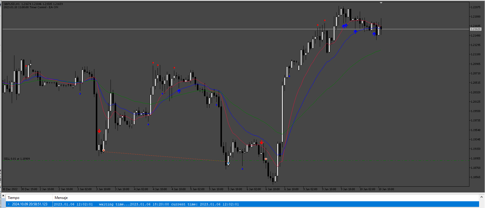

Try this version.

 [Pinbar_Magic_EA_v3.mq5](files/156951/Pinbar_Magic_EA_v3.mq5)

---

## Re: Pinbar_Magic_EA

**Apprentice** · Fri Sep 05, 2025 3:09 am

Task 278

 [Pinbar_Magic_EA.mq4](files/160470/Pinbar_Magic_EA.mq4)
