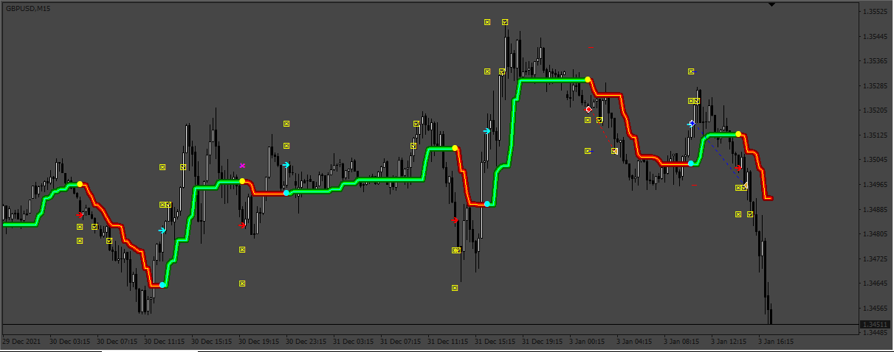
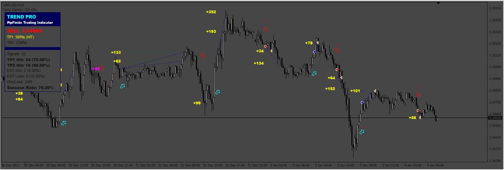

# PipFinite_EA

> Source: https://fxcodebase.com/code/viewtopic.php?f=38&t=74287  
> Forum: 38 · Topic 74287 · 14 post(s)

---

## PipFinite_EA

**Apprentice** · Tue Oct 24, 2023 5:13 am

Based on the request.
[https://fxcodebase.com/code/viewtopic.php?f=17&t=74254](https://fxcodebase.com/code/viewtopic.php?f=17&t=74254)

 [PipFinite_Trend_PRO_fix.ex4](files/153051/PipFinite_Trend_PRO_fix.ex4)

 [PipFinite_EA.mq4](files/153051/PipFinite_EA.mq4)

---

## Re: PipFinite_EA

**rickCreations** · Wed Oct 25, 2023 12:46 am

Making a request

1) embed the Indicator inside the EA.
2) Make all the drawable objects from the indicator visible when the ea is applied to the chart.

---

## Re: PipFinite_EA

**Mahadeo1806** · Wed Oct 25, 2023 4:40 am

i am backing testing it take only sell trade
please update buffer value

---

## Re: PipFinite_EA

**Apprentice** · Thu Oct 26, 2023 2:22 am

We have added your request to the development list.
Development reference 964

---

## Re: PipFinite_EA

**rickCreations** · Thu Oct 26, 2023 8:19 am

i can confirm. when applying to the chart :

2023.10.26 21:14:51.689	2023.07.03 00:04:01 PipFinite_EA USDJPY,H1: invalid pointer access in 'PipFinite_EA.mq4' (3643,13)

Code: [Select all](https://fxcodebase.com/code/)
`//--- CANDLE CLOSE:
    if(CloseCandleMode)
        if(!newCandle.IsNewCandle())
        {
            return;
        }`

Even if you don't have the option enabled its still being triggered some how.

---

## Re: PipFinite_EA

**Apprentice** · Fri Nov 10, 2023 8:04 am

 [PipFinite_EA_v2.mq4](files/153224/PipFinite_EA_v2.mq4)

---

## Re: PipFinite_EA

**jollyjegan** · Tue Jan 14, 2025 9:03 am

> **Apprentice wrote:**
>
>
> 927.png
>
>
> Based on the request.
> [https://fxcodebase.com/code/viewtopic.php?f=17&t=74254](https://fxcodebase.com/code/viewtopic.php?f=17&t=74254)
>
>
> PipFinite_Trend_PRO_fix.ex4
>
>
>
>
> PipFinite_EA.mq4

 This "PipFinite_Trend_PRO_fix.ex4" indicator is for old version of Metatrader. kindly update latest build version.

 kindly convert this indicator & EA to metatrader-5 build. Thanks in advance.

---

## Re: PipFinite_EA

**Apprentice** · Wed Jan 15, 2025 1:02 pm

Only if someone can provide the Mq4 version of the indicator.
Or any other implementation for other trading platforms.

---

## Re: PipFinite_EA

**D-JONES** · Thu Jan 16, 2025 2:45 am

> **Apprentice wrote:**
> Only if someone can provide the Mq4 version of the indicator.
> Or any other implementation for other trading platforms.

here you are

---

## Re: PipFinite_EA

**Apprentice** · Thu Jan 16, 2025 4:44 am

this is .ex4 we need .mq4

---

## Re: PipFinite_EA

**xmohammad** · Fri Jan 17, 2025 3:09 am

> **Apprentice wrote:**
> this is .ex4 we need .mq4

use buffers
it.s on about tab

---

## Re: PipFinite_EA

**jollyjegan** · Mon Jan 20, 2025 4:31 am

> **Apprentice wrote:**
> this is .ex4 we need .mq4

 Here is the mql4 format for that indicator. Only buy, sell arrows appears. not TP or SL. redesign TP 1, Tp2, SL. make it mql4 after that convert mql5 indicator & EA. Thanks in advance.

 [linetrend-shab.mq4](files/157886/linetrend-shab.mq4)

---

## Re: PipFinite_EA

**Apprentice** · Thu Jan 23, 2025 3:33 pm

We have added your request to the development list.
Development reference 59

---

## Re: PipFinite_EA

**Apprentice** · Wed Feb 05, 2025 4:07 pm

Try this version.
[https://fxcodebase.com/code/viewtopic.php?f=38&t=75585](https://fxcodebase.com/code/viewtopic.php?f=38&t=75585)
