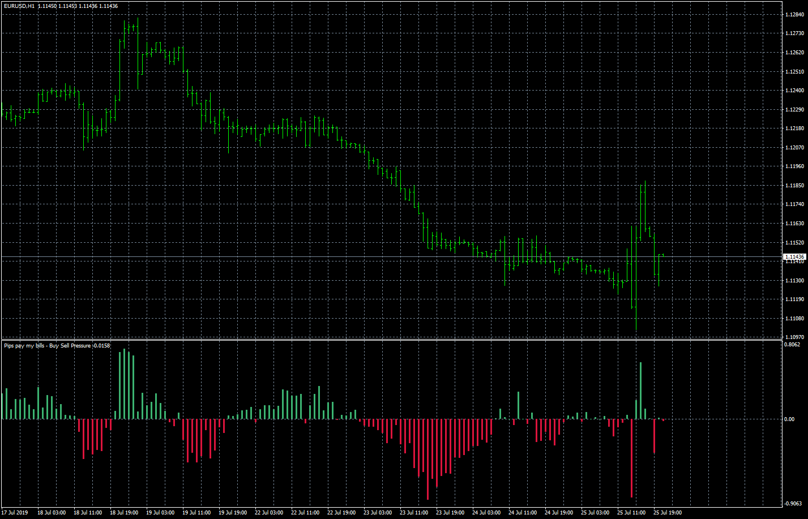
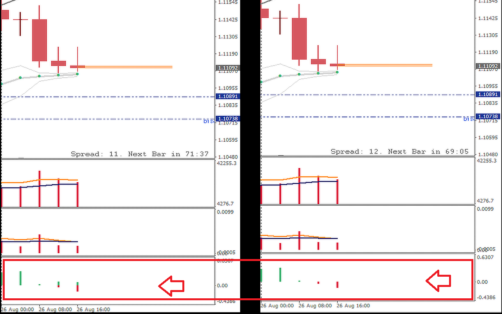
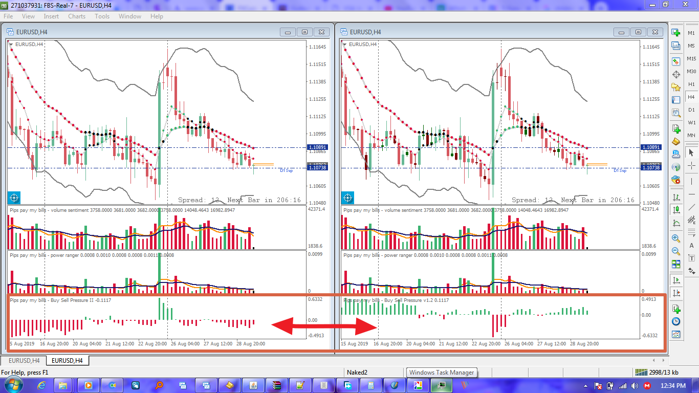

# Pips pay my bills - Buy Sell Pressure

> Source: https://fxcodebase.com/code/viewtopic.php?f=38&t=68850  
> Forum: 38 · Topic 68850 · 18 post(s)

---

## Pips pay my bills - Buy Sell Pressure

**Apprentice** · Mon Aug 26, 2019 5:46 am

Based on request.
[viewtopic.php?f=27&t=68829](https://fxcodebase.com/code/viewtopic.php?f=27&t=68829)

 [Pips pay my bills - Buy Sell Pressure.mq4](files/128196/Pips%20pay%20my%20bills%20-%20Buy%20Sell%20Pressure.mq4)

---

## Re: Pips pay my bills - Buy Sell Pressure

**paulcarissimo** · Mon Aug 26, 2019 7:05 am

> **Apprentice wrote:**
>
>
> eurusd-h1-forex-capital-markets.png
>
>
> Based on request.
> [viewtopic.php?f=27&t=68829](https://fxcodebase.com/code/viewtopic.php?f=27&t=68829)
>
>
> Pips pay my bills - Buy Sell Pressure.mq4

Thank you very much Apprentice! and it only recalculates bar 0 , perfect !

---

## Re: Pips pay my bills - Buy Sell Pressure

**paulcarissimo** · Mon Aug 26, 2019 1:01 pm

I modified the code a bit to eliminate a display error, you may optimize.
Regards.

---

## Re: Pips pay my bills - Buy Sell Pressure

**Apprentice** · Tue Aug 27, 2019 7:19 am

Your request is added to the development list.
 Internal developer reference 5.

---

## Re: Pips pay my bills - Buy Sell Pressure

**paulcarissimo** · Tue Aug 27, 2019 10:59 am

> **Apprentice wrote:**
> Your request is added to the development list.
> Internal developer reference 5.

Thank you Apprentice.

---

## Re: Pips pay my bills - Buy Sell Pressure

**Apprentice** · Thu Aug 29, 2019 6:10 am

Try this version.

 [Pips pay my bills - Buy Sell Pressure v1.2.mq4](files/128283/Pips%20pay%20my%20bills%20-%20Buy%20Sell%20Pressure%20v1.2.mq4)

---

## Re: Pips pay my bills - Buy Sell Pressure

**paulcarissimo** · Thu Aug 29, 2019 6:32 am

> **Apprentice wrote:**
> Try this version.
>
>
> The attachment **Pips pay my bills - Buy Sell Pressure v1.2.mq4** is no longer available

The indicator is now inverted

 

---

## Re: Pips pay my bills - Buy Sell Pressure

**logicgate** · Sat Aug 31, 2019 8:50 am

This indicator would benefit from an option to choose how many bars to use in the calculation, to display an average of pressure. For example let´s say I wanna know the pressure of the last 5 bars?

---

## Re: Pips pay my bills - Buy Sell Pressure

**Apprentice** · Sun Sep 01, 2019 4:46 am

Your request is added to the development list.
 Internal developer reference 24.

---

## Re: Pips pay my bills - Buy Sell Pressure

**logicgate** · Fri Sep 06, 2019 11:33 am

Dear friend Apprentice, while you are working on this, you could also try to correct this behavior:

When the indi is loaded on a chart, if you change the timeframe it will make MT4 to hang and not respond, if you get lucky it comes back to normal, otherwise you have to force quit.

---

## Re: Pips pay my bills - Buy Sell Pressure

**logicgate** · Sun Sep 08, 2019 9:13 pm

Hi there my friend. Another thing I noticed you might be able to correct:

This indicator is not plotting historically on tick charts. You can see in the screenshot that on a timebased chart it plots. On the tick chart nothing is plotted, it starts working only at the minute you load it forwards. But you can see that the wave volume and the weis wave are working properly and plotting historically.

---

## Re: Pips pay my bills - Buy Sell Pressure

**Apprentice** · Mon Sep 09, 2019 3:37 am

Indicator uses high and low price in the calculation.

---

## Re: Pips pay my bills - Buy Sell Pressure

**Apprentice** · Tue Oct 22, 2019 9:04 am

Based on request 24.

 [Pips_pay_my_bills_-_Buy_Sell_Pressure_v1.3.mq4](files/129377/Pips_pay_my_bills_-_Buy_Sell_Pressure_v1.3.mq4)

I don't understand #2.

---

## Re: Pips pay my bills - Buy Sell Pressure

**logicgate** · Tue Oct 22, 2019 10:01 am

Thanks my friend, gonna test it now.

---

## Re: Pips pay my bills - Buy Sell Pressure

**logicgate** · Fri Jul 15, 2022 6:52 am

> **Apprentice wrote:**
> Based on request 24.
>
>
> Pips_pay_my_bills_-_Buy_Sell_Pressure_v1.3.mq4
>
>
> I don't understand #2.

Hello my friend.

Can we get a MT5 version of 1.3? And can you add a MTF input to it?

Best regards

---

## Re: Pips pay my bills - Buy Sell Pressure

**Apprentice** · Sat Jul 16, 2022 2:07 pm

As Dashboard or as another Time Frame Oscillator?

We have added your request to the development list.
Development reference 424.

---

## Re: Pips pay my bills - Buy Sell Pressure

**logicgate** · Sun Jul 17, 2022 8:11 am

> **Apprentice wrote:**
> As Dashboard or as another Time Frame Oscillator?
>
> We have added your request to the development list.
> Development reference 424.

Not as a dashboard, just a MTF input so we can select what TF to display;

---

## Re: Pips pay my bills - Buy Sell Pressure

**Apprentice** · Thu Jan 23, 2025 4:49 pm

 [Pips_pay_my_bills_-_Buy_Sell_Pressure.mq5](files/157989/Pips_pay_my_bills_-_Buy_Sell_Pressure.mq5)
