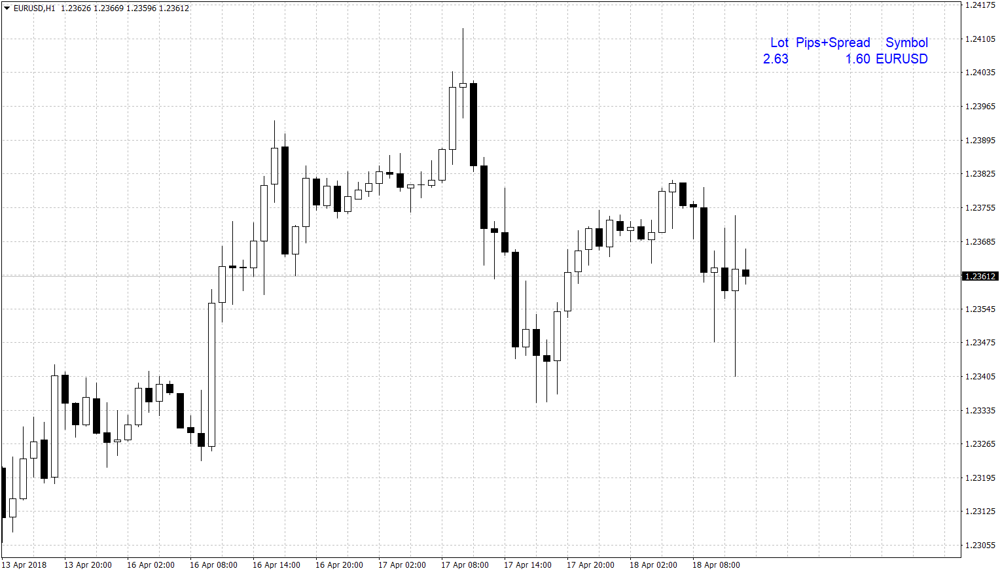

# Pips_spread

> Source: https://fxcodebase.com/code/viewtopic.php?f=38&t=65951  
> Forum: 38 · Topic 65951 · 6 post(s)

---

## Pips_spread

**Apprentice** · Wed Apr 18, 2018 7:36 am

Based on the request.
[viewtopic.php?f=27&t=65892](https://fxcodebase.com/code/viewtopic.php?f=27&t=65892)

 [pips_spread.mq4](files/118716/pips_spread.mq4)

TS2/Marketscope version.
[viewtopic.php?f=17&t=66101](https://fxcodebase.com/code/viewtopic.php?f=17&t=66101)

---

## Re: Pips_spread

**hashinko** · Wed Apr 18, 2018 12:29 pm

I tried it and i don't understand some meaning of numbers
Basically the lots should deacrese as the candle growing (the more the candle is growing, the more the pips are, so the stop will be higher/lower with a numbers of lots according to 1% of the account) but here it don't
Next, below pips + spread the numbers didn't match with the actual value of the candle (in term of pips), and below the pips text, it could be great to show actual pips value of candle (for up : lowest point + close + spread ; for down highest point + close + spread)
Hope it can be done like that

---

## Re: Pips_spread

**Apprentice** · Mon Apr 23, 2018 5:30 am

Try it now.
The calculation was reversed.

---

## Re: Pips_spread

**THIBAULT** · Mon Apr 23, 2018 6:41 am

Hello Apprentice,
I would know if you could make this indictor for FXCM please ?
If yes, thank you very much =)

---

## Re: Pips_spread

**hashinko** · Tue Apr 24, 2018 2:24 am

Work great now thank you !

---

## Re: Pips_spread

**Apprentice** · Fri May 04, 2018 8:24 am

TS2/Marketscope version.
[viewtopic.php?f=17&t=66101](https://fxcodebase.com/code/viewtopic.php?f=17&t=66101)
