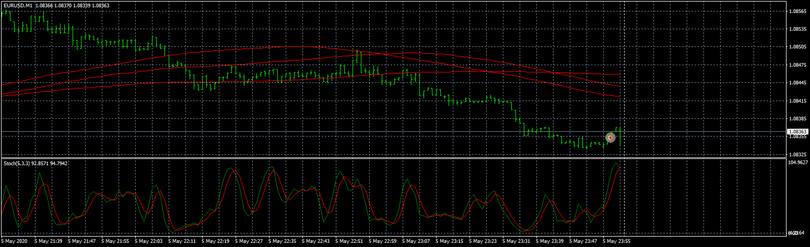
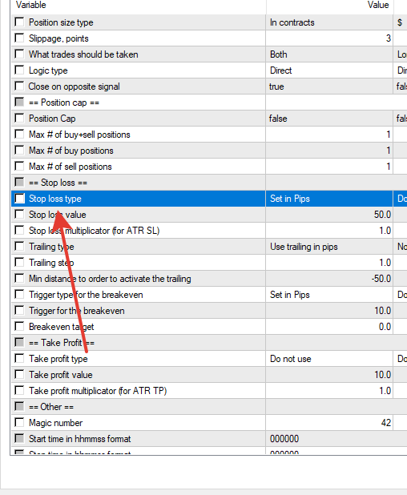

# pivot-ma-price_cloud_EA

> Source: https://fxcodebase.com/code/viewtopic.php?f=38&t=70609  
> Forum: 38 · Topic 70609 · 31 post(s)

---

## pivot-ma-price_cloud_EA

**Apprentice** · Mon Nov 09, 2020 5:09 pm

Based on request.
[viewtopic.php?f=31&t=70445&start=10](https://fxcodebase.com/code/viewtopic.php?f=31&t=70445&start=10)

 [pivot-ma-price_cloud_EA.mq4](files/138767/pivot-ma-price_cloud_EA.mq4)

 [pivot-ma-price_cloud_EA.mq5](files/138767/pivot-ma-price_cloud_EA.mq5)

---

## Re: pivot-ma-price_cloud_EA

**yolerap** · Mon Nov 09, 2020 6:07 pm

Top !

Could you add the option " Choose which Day of the month close all positions" please ? I want have the possibility to close trades the first Day of a new month or other day.
Actual possibility is to choose which Day of the week but for m'y money management is not enough.

More, add the possibility to choose one more stop loss parameter : maximum X% of my account.

Thank you !

---

## Re: pivot-ma-price_cloud_EA

**Apprentice** · Wed Nov 11, 2020 2:33 pm

Your request is added to the development list.
Development reference 2279.

---

## Re: pivot-ma-price_cloud_EA

**Apprentice** · Thu Nov 12, 2020 3:38 am

[pivot-ma-price_cloud_EA.mq4](files/138833/pivot-ma-price_cloud_EA.mq4)

Try this version.

---

## Re: pivot-ma-price_cloud_EA

**yolerap** · Wed Nov 18, 2020 8:30 am

Thank you Apprentice.

Please could you explain me or update the strategy why the stop loss is not put directly after the position was opened ? Because of that, the drawdown is too high..

Regards,

---

## Re: pivot-ma-price_cloud_EA

**yolerap** · Wed Nov 18, 2020 8:31 am

Thank you Apprentice.

Please could you explain me or update the strategy why the stop loss is not put directly after the position was opened ? Because of that, the drawdown is too high..

Regards,

---

## Re: pivot-ma-price_cloud_EA

**Apprentice** · Wed Nov 18, 2020 9:00 am

Your request is added to the development list.
Development reference 2325.

---

## Re: pivot-ma-price_cloud_EA

**Apprentice** · Wed Nov 18, 2020 11:08 am

I don't have any issues. Have you enable stop loss in the parameters?

---

## Re: pivot-ma-price_cloud_EA

**yolerap** · Wed Nov 18, 2020 11:44 am

Yes stop loss is enabled..

Please translate the latest version of the EA to MT5, maybe the stop loss will run correctly.

Thank you Sir,

---

## Re: pivot-ma-price_cloud_EA

**Apprentice** · Thu Nov 19, 2020 2:48 pm

Your request is added to the development list.
Development reference 2332.

---

## Re: pivot-ma-price_cloud_EA

**Apprentice** · Sun Nov 22, 2020 6:16 am

pivot-ma-price_cloud_EA.mq5 added.

---

## Re: pivot-ma-price_cloud_EA

**yolerap** · Thu Nov 26, 2020 9:59 am

Sorry but I can't run this EA beacause I have errors.. Could you help me or repair this ?

Thank you,

---

## Re: pivot-ma-price_cloud_EA

**Apprentice** · Fri Nov 27, 2020 7:11 am

Your request is added to the development list.
Development reference 2365.

---

## Re: pivot-ma-price_cloud_EA

**Apprentice** · Sun Nov 29, 2020 3:52 am

I don't have any issues. Could you show what parameters you are using?

---

## Re: pivot-ma-price_cloud_EA

**yolerap** · Wed Dec 02, 2020 8:06 am

Hi,
I've a better solution for repair this EA. Is it possible to modify the code of the MT4 EA like this :

When one position is opened, apply the stop loss/take profit management (don't change the code for this). After X minutes, EA need to verify if all orders have a stop loss and take profit. If not, apply the same initial stop loss/take profit management.

I hope it's possible to modify the code like explain;

Thank you,

---

## Re: pivot-ma-price_cloud_EA

**Apprentice** · Thu Dec 03, 2020 12:38 pm

Your request is added to the development list.
Development reference 2395.

---

## Re: pivot-ma-price_cloud_EA

**Apprentice** · Fri Dec 04, 2020 1:59 pm

ECN mode does exactly like that

---

## Re: pivot-ma-price_cloud_EA

**yolerap** · Sun Dec 06, 2020 2:30 am

Well... It's annoying...

So could you create an EA for the money management with the same possibilities like in the EA Pivot-ma-price_cloud.MT5 ?

When i tell possibilities it's in particular for :
take profit -> %account lot size, %risk, with ATR, ...
Stop loss -> %account lot size, %risk, with ATR, ...

Thank you,

---

## Re: pivot-ma-price_cloud_EA

**Apprentice** · Sun Dec 06, 2020 6:49 am

Your request is added to the development list.
Development reference 2409.

---

## Re: pivot-ma-price_cloud_EA

**Apprentice** · Tue Dec 08, 2020 9:04 am

Try this version.
[viewtopic.php?f=38&t=70609](https://fxcodebase.com/code/viewtopic.php?f=38&t=70609)

---

## Re: pivot-ma-price_cloud_EA

**crazyfly** · Wed Dec 09, 2020 3:15 am

Cn You HELP , Which Account Type this EA works.

EA Gives Error. "UNSUPPORTED FILLING MODE"

---

## Re: pivot-ma-price_cloud_EA

**Apprentice** · Thu Dec 10, 2020 5:42 am

Can you specify the exact file name?

---

## Re: pivot-ma-price_cloud_EA

**yolerap** · Thu Dec 10, 2020 12:26 pm

Sorry but the latest link which you posted
(Re: pivot-ma-price_cloud_EA
Postby Apprentice » Tue Dec 08, 2020 9:04 am
Try this version.
viewtopic.php?f=38&t=70609 )

redirect me to the Pivot-ma-price_cloud EA and not an EA independent doing a money management..

Thank you,

---

## Re: pivot-ma-price_cloud_EA

**Apprentice** · Fri Dec 11, 2020 4:03 am

Your request is added to the development list.
Development reference 2441.

---

## Re: pivot-ma-price_cloud_EA

**Apprentice** · Sat Dec 12, 2020 7:26 am

What broker you are using?

---

## Re: pivot-ma-price_cloud_EA

**yolerap** · Mon Dec 14, 2020 11:14 am

Hello,

Is it possible to modify the MT4 version of the EA please ?

I want that the EA has two stop loss possibilities in the same time. Don't change the first parameters about stop loss.
And add the second stop loss parameters : all of positions are automatically stopped when they reach the X % of all profit that the strategy maked.

Thank you,

---

## Re: pivot-ma-price_cloud_EA

**Apprentice** · Tue Dec 15, 2020 11:31 am

Your request is added to the development list.
Development reference 2470.

---

## Re: pivot-ma-price_cloud_EA

**Apprentice** · Wed Dec 16, 2020 10:31 am

[pivot-ma-price_cloud_EA.mq4](files/139630/pivot-ma-price_cloud_EA.mq4)

Try this version.

---

## Re: pivot-ma-price_cloud_EA

**SmithAlfred** · Tue Oct 19, 2021 4:47 am

Good morning,

Is it possible to add one option please,
I wish it's possible ; the strategy close the loss positions after X candles of the current timeframe.

Thank you for work,
Have a nice day

---

## Re: pivot-ma-price_cloud_EA

**Apprentice** · Wed Oct 20, 2021 6:08 am

Your request is added to the development list.
Development reference 925.

---

## Re: pivot-ma-price_cloud_EA

**Apprentice** · Fri Nov 05, 2021 9:22 am

[pivot-ma-price_cloud_EA.mq4](files/144184/pivot-ma-price_cloud_EA.mq4)

Try this version.

Please use the "Quantity of Candle to close a loser position" parameter.
