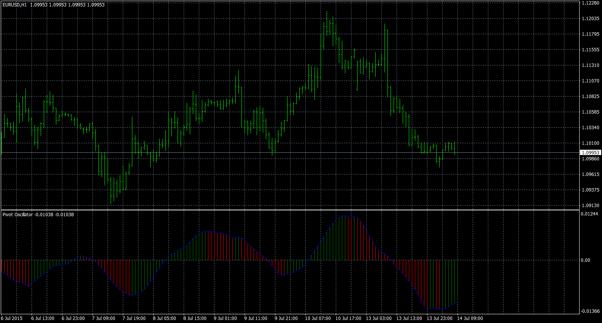

# Pivot Oscillator

> Source: https://fxcodebase.com/code/viewtopic.php?f=38&t=64319  
> Forum: 38 · Topic 64319 · 1 post(s)

---

## Pivot Oscillator

**Apprentice** · Sat Jan 21, 2017 6:04 am

Based on the original Lua.
[viewtopic.php?f=17&t=63526&p=110637#p110637](https://fxcodebase.com/code/viewtopic.php?f=17&t=63526&p=110637#p110637)

Differential 1: Fast_MA of Typical Price-Slow_MA of Typical Price
Differential 2: Medium_MA of Typical Price -Slow_MA of Typical Price
Differential 3 : Fast_MA of Typical Price -Medium_MA of Typical Price
Pivot oscillator = ((Diff1 + Diff2 + Diff3) / Typical Price)

 [Pivot Oscillator.mq4](files/110638/Pivot%20Oscillator.mq4)
