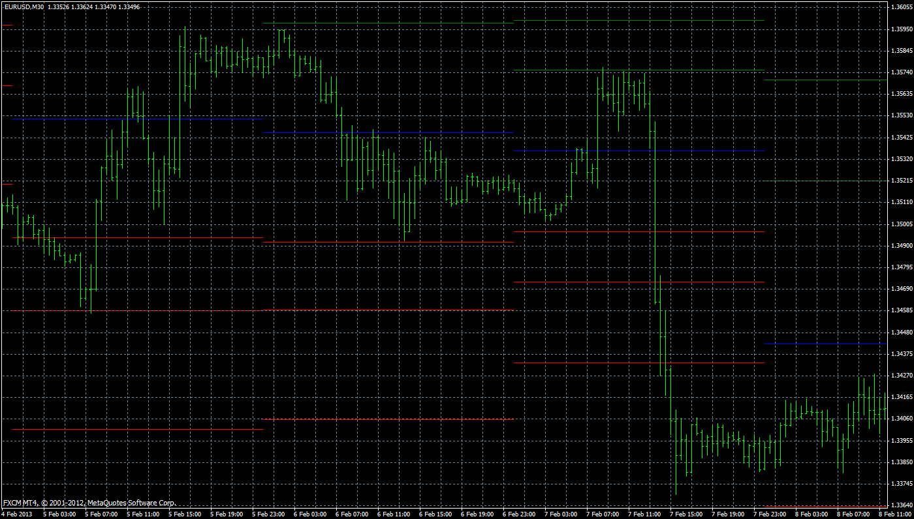

# Pivot Point Indicator

> Source: https://fxcodebase.com/code/viewtopic.php?f=38&t=32374  
> Forum: 38 · Topic 32374 · 17 post(s)

---

## Pivot Point Indicator

**Apprentice** · Sun Feb 24, 2013 6:37 am

Select 1 for Classical Pivot, 2 for Camarilla, 3 for Woodie, 4 for Fibonacci, 5 for Floor or 6 For Fibonacci Retracement

 [Pivot.mq4](files/55174/Pivot.mq4)

 [Pivot_Middle_Lines.mq5](files/55174/Pivot_Middle_Lines.mq5)

This is the first version, further improvements are possible.
MT4 is not my primary domain, so your help is appreciated.

---

## Re: Pivot Point Indicator

**DAVIDR** · Sat Oct 31, 2015 12:49 pm

Hi, FXCM Marketscope has a Pivot Point Indicator with Midpoint Levels. any chance of adding midpoint levels to this MT4 indicator?

---

## Re: Pivot Point Indicator

**Apprentice** · Tue Nov 03, 2015 6:28 am

Try it now.

---

## Re: Pivot Point Indicator

**nookie** · Thu Feb 08, 2018 1:14 pm

This indicator when loaded completely freezes the MT4 and it becomes frozen, is there any way to improve it ?

---

## Re: Pivot Point Indicator

**Apprentice** · Fri Feb 09, 2018 12:04 pm

Try it now.

---

## Re: Pivot Point Indicator

**nookie** · Fri Feb 09, 2018 5:48 pm

Same thing

---

## Re: Pivot Point Indicator

**Apprentice** · Sat Feb 10, 2018 7:26 am

Bug fixed.
Try do re-download or to use another browser.

---

## Re: Pivot Point Indicator

**jelogui83** · Tue Feb 20, 2018 10:44 am

Hi everyone, excellent indicator Apprentice !
could you tell me how to improve one fact ?
as i don't use the MR and MS levels, i deleted the lines, but the names stay on the chart and that's disturbing. how can we delete also the text MS1 MS2 MS3 MR1 MR2 MR3 ?
thanks a lot.

---

## Re: Pivot Point Indicator

**Apprentice** · Wed Feb 21, 2018 2:13 pm

Try it now.

---

## Re: Pivot Point Indicator

**Apprentice** · Sat Feb 24, 2018 6:27 am

Historical option added.

---

## Re: Pivot Point Indicator

**Apprentice** · Wed Aug 08, 2018 11:04 am

Minor bug fixed.

---

## Re: Pivot Point Indicator

**Tom_76** · Sat Dec 21, 2019 10:32 am

Hello,
the MR1 appear above the R1, could you correct this bug pls ?

---

## Re: Pivot Point Indicator

**Apprentice** · Mon Dec 23, 2019 5:50 am

Your request is added to the development list.
Development reference 465.

---

## Re: Pivot Point Indicator

**Jagg1010** · Wed Jan 29, 2020 8:55 am

> **Apprentice wrote:**
>
>
> The attachment **Pivot.mq4** is no longer available
>
>
> Try this version.

small bug

update: Attachment was gone?!
line 385 "i=0" must be "int i=0"

---

## Re: Pivot Point Indicator

**Apprentice** · Wed Jan 29, 2020 5:25 pm

Your request is added to the development list.
Development reference 607.

---

## Re: Pivot Point Indicator

**Apprentice** · Thu Jan 30, 2020 5:12 pm

Try this version.

 [Pivot.mq4](files/130994/Pivot.mq4)

---

## Re: Pivot Point Indicator

**Apprentice** · Tue Apr 27, 2021 11:56 am

Pivot_Middle_Lines.mq5 aded.
(First/Topmost post)
