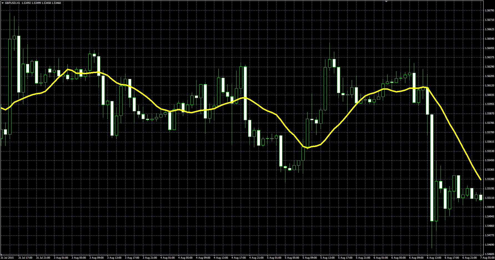

# Pivot Point Moving Average

> Source: https://fxcodebase.com/code/viewtopic.php?f=38&t=62776  
> Forum: 38 · Topic 62776 · 1 post(s)

---

## Pivot Point Moving Average

**Alexander.Gettinger** · Mon Oct 12, 2015 2:16 pm

Pivot Point Moving Average (PPMA).

Formula:
PPMA = MVA(Typical price) with [Length] number of periods.

 

Download:

 [PPMA.mq4](files/102800/PPMA.mq4)
