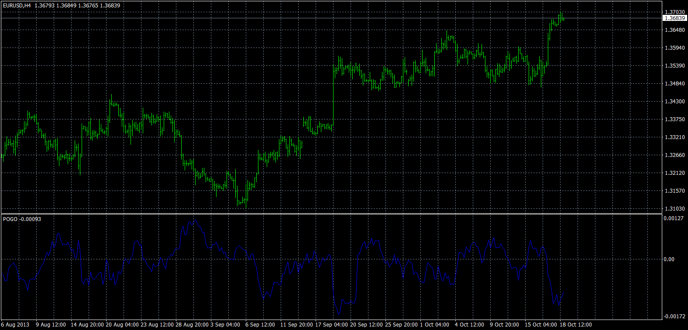

# POGO

> Source: https://fxcodebase.com/code/viewtopic.php?f=38&t=63451  
> Forum: 38 · Topic 63451 · 1 post(s)

---

## POGO

**Apprentice** · Fri May 06, 2016 4:00 am

Raw = Open-Close;
POGO = MA of Raw;

 [POGO.mq4](files/106126/POGO.mq4)

TS2/Marketscope Version
[viewtopic.php?f=17&t=63275&p=105404&hilit=POGO+indicator#p105404](https://fxcodebase.com/code/viewtopic.php?f=17&t=63275&p=105404&hilit=POGO+indicator#p105404)
