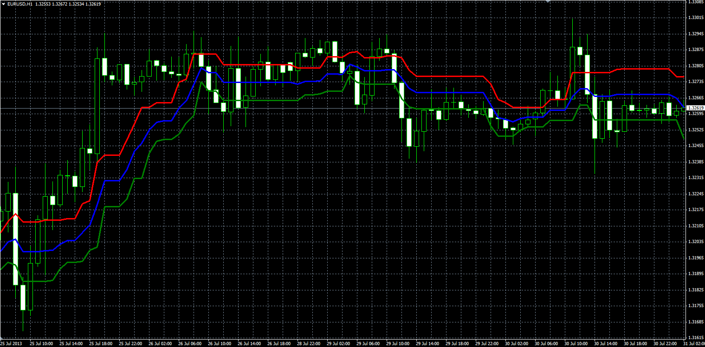

# Point of Balance

> Source: https://fxcodebase.com/code/viewtopic.php?f=38&t=59135  
> Forum: 38 · Topic 59135 · 1 post(s)

---

## Point of Balance

**Alexander.Gettinger** · Wed Aug 14, 2013 3:22 pm

Original LUA indicator: [http://fxcodebase.com/code/viewtopic.php?f=17&t=36543](https://fxcodebase.com/code/viewtopic.php?f=17&t=36543).

Formulas:
BL = (MinH+MaxH)/2,
BR = (MinL+MaxL)/2,
POB = (BL+BR)/2, where
MinH, MaxH - minimum and maximum HIGH prices at range from (i-Length) to i,
MinL, MaxL - minimum and maximum LOW prices at range from (i-Length) to i.

 

Download:

 [POB.mq4](files/88596/POB.mq4)
