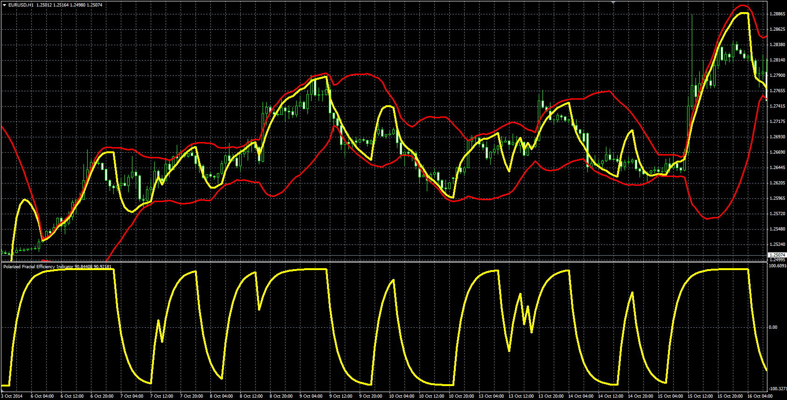

# Polarized Fractal Efficiency (PFE)

> Source: https://fxcodebase.com/code/viewtopic.php?f=38&t=61627  
> Forum: 38 · Topic 61627 · 1 post(s)

---

## Polarized Fractal Efficiency (PFE)

**Alexander.Gettinger** · Mon Dec 22, 2014 10:33 am

Original LUA oscillators: [viewtopic.php?f=17&t=2921](https://fxcodebase.com/code/viewtopic.php?f=17&t=2921).

Formulas:
PFE = EMA(B) with [MA_Length] number of periods, where
B = 100*z, if Close[i]>Close[i-ROC_Long_Length], else B = -100*z,
z = Sqrt(ROC_Long*ROC_Long+100)/(Sqrt(ROC_Short*ROC_Short+1)+PDS),
ROC_Long[i] = 100*(Close[i]/Close[i-ROC_Long_Length]-1),
ROC_Short[i] = 100*(Close[i]/Close[i-ROC_Short_Length]-1).

 

Download:

 [PFE.mq4](files/97834/PFE.mq4)

 [PFE_Overlay.mq4](files/97834/PFE_Overlay.mq4)
