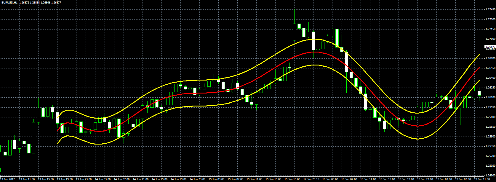

# Polynomial regression

> Source: https://fxcodebase.com/code/viewtopic.php?f=38&t=20393  
> Forum: 38 · Topic 20393 · 1 post(s)

---

## Polynomial regression

**Alexander.Gettinger** · Tue Jun 19, 2012 5:28 pm

Original indicator: [viewtopic.php?f=17&t=3715](https://fxcodebase.com/code/viewtopic.php?f=17&t=3715)

> Indicator draw a regression curve that is best fits the prices between a starting price point and an ending point.
>
> Parameter [Power] defines power of polynomial which will be used.
> [Period] defines range of data on chart.
> [Deviation] is used for building band.
>
> If Power=1 we have a linear regression,
> if power=2 - quadratic regression and etc.

 

Download:

 [Polynomial_Regression.mq4](files/35759/Polynomial_Regression.mq4)
