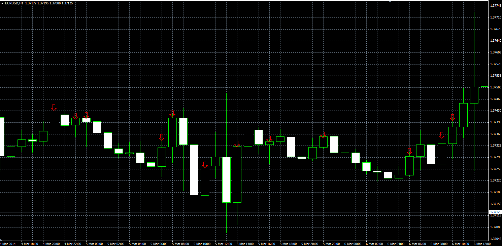

# Position of Open/Close

> Source: https://fxcodebase.com/code/viewtopic.php?f=38&t=60487  
> Forum: 38 · Topic 60487 · 1 post(s)

---

## Position of Open/Close

**Alexander.Gettinger** · Thu Apr 03, 2014 10:41 am

The indicators highlight the bars with the specified position of Open/Close within the bar.

 

Download:

 [Position_Of_Open.mq4](files/93345/Position_Of_Open.mq4)

 [Position_Of_Close.mq4](files/93345/Position_Of_Close.mq4)
