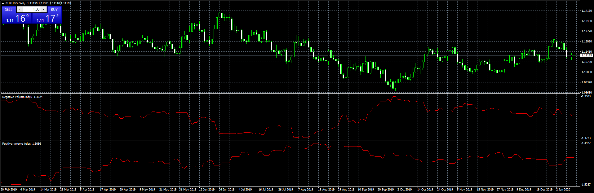
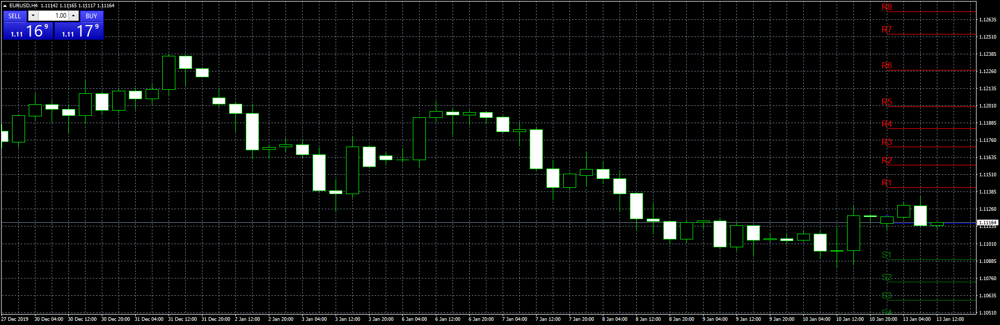
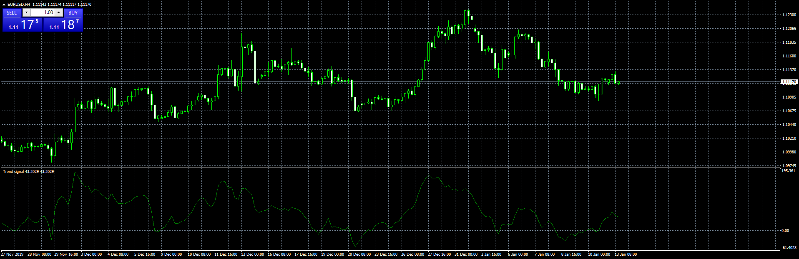

# Positive Volume Index

> Source: https://fxcodebase.com/code/viewtopic.php?f=38&t=69314  
> Forum: 38 · Topic 69314 · 3 post(s)

---

## Positive Volume Index

**Apprentice** · Mon Jan 13, 2020 6:57 am

Based on request.
[viewtopic.php?f=27&t=69305](https://fxcodebase.com/code/viewtopic.php?f=27&t=69305)

 [positive_volume_index.mq4](files/130710/positive_volume_index.mq4)

 [negative_volume_index.mq4](files/130710/negative_volume_index.mq4)

---

## intraday levels

**Apprentice** · Mon Jan 13, 2020 6:59 am

 [intraday_levels.mq4](files/130711/intraday_levels.mq4)

---

## trend signal

**Apprentice** · Mon Jan 13, 2020 7:03 am

Money Flow Index (MFI)
[viewtopic.php?f=38&t=60402](https://fxcodebase.com/code/viewtopic.php?f=38&t=60402)

 [trend_signal.mq4](files/130712/trend_signal.mq4)
