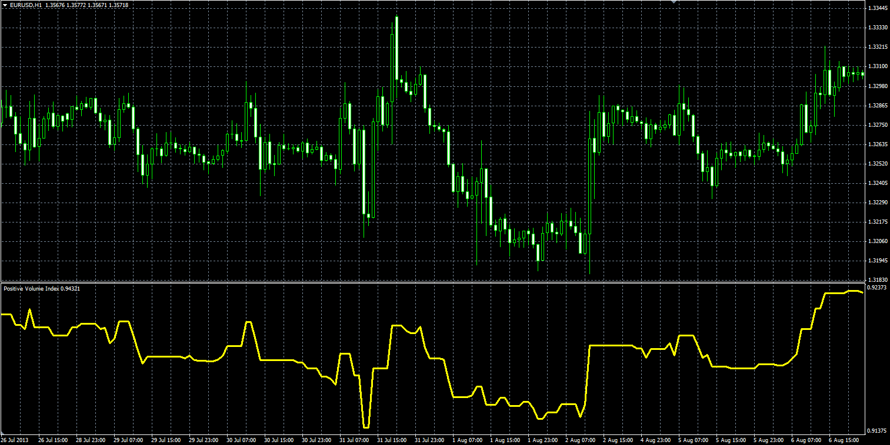

# Positive Volume Index

> Source: https://fxcodebase.com/code/viewtopic.php?f=38&t=59616  
> Forum: 38 · Topic 59616 · 1 post(s)

---

## Positive Volume Index

**Alexander.Gettinger** · Mon Oct 07, 2013 12:47 pm

Formulas:
PVI[i]=PVI[i-1], if Volume[i]<=Volume[i-1] and
PVI[i]=PVI[i-1]*(1+(Close[i]-Close[i-1])/Close[i-1]), if Volume[i]>Volume[i-1].

 

Download:

 [PVI.mq4](files/89867/PVI.mq4)
