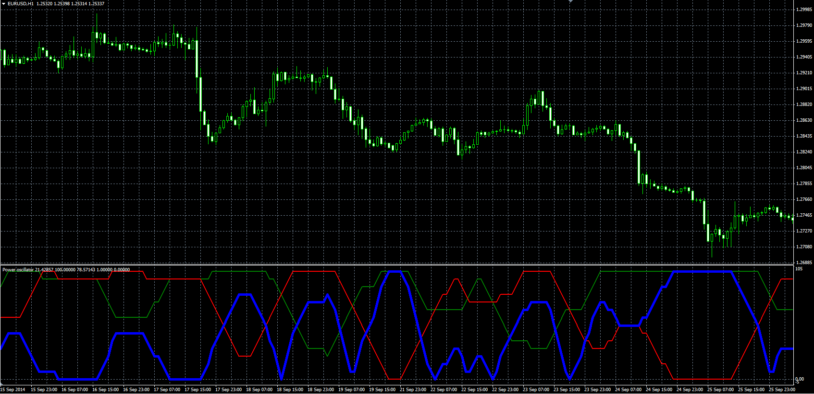

# Power oscillator

> Source: https://fxcodebase.com/code/viewtopic.php?f=38&t=61470  
> Forum: 38 · Topic 61470 · 1 post(s)

---

## Power oscillator

**Alexander.Gettinger** · Tue Nov 18, 2014 12:15 pm

The indicator compares the power of bulls and bears.

Formulas:
Power = 100*(BullPower - BearPower), where
BullPower = MVA(Bulls) with [Lookback_Length] number of periods,
BearPower = MVA(Bears) with [Lookback_Length] number of periods,
Bulls = 1, if High>EMA(Close price), else Bulls = 0,
Bears = 1, if Low<EMA(Close price), else Bears = 0.

 

Download:

 [Power.mq4](files/97166/Power.mq4)
