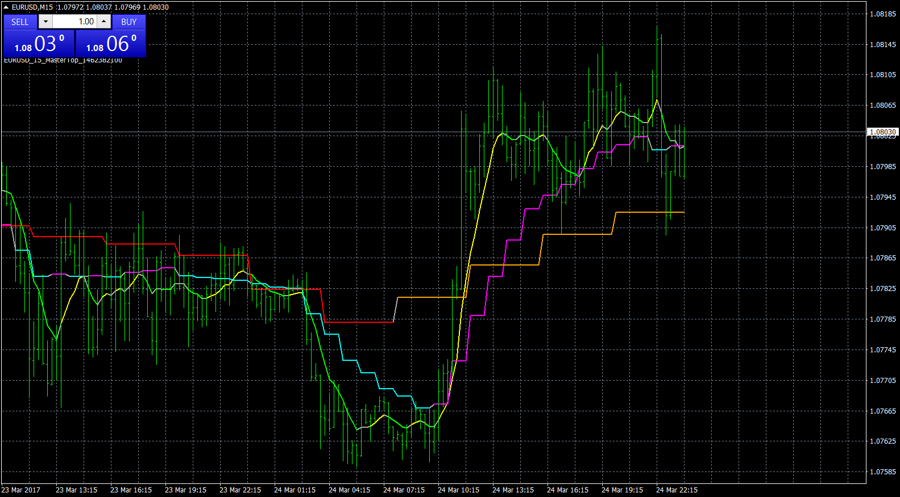

# Power Weighted Moving Average MTF

> Source: https://fxcodebase.com/code/viewtopic.php?f=38&t=64546  
> Forum: 38 · Topic 64546 · 1 post(s)

---

## Power Weighted Moving Average MTF

**Apprentice** · Sun Mar 26, 2017 5:59 am

LUA Original: [viewtopic.php?f=17&t=6305](https://fxcodebase.com/code/viewtopic.php?f=17&t=6305)

Description:

This is the LUA to MT4 version of the PWMA (Power Weighted MA), which uses the following formula:

PWMA = SUM(Price(i)*(i^Power), Period)/SUM(i^Power, Period)

This version includes the MTF scenario, so the trader can follow 3 higher TF PWMA's and also the Up and Down colors for each MA.

 [PWMA_MTF.mq4](files/111686/PWMA_MTF.mq4)
