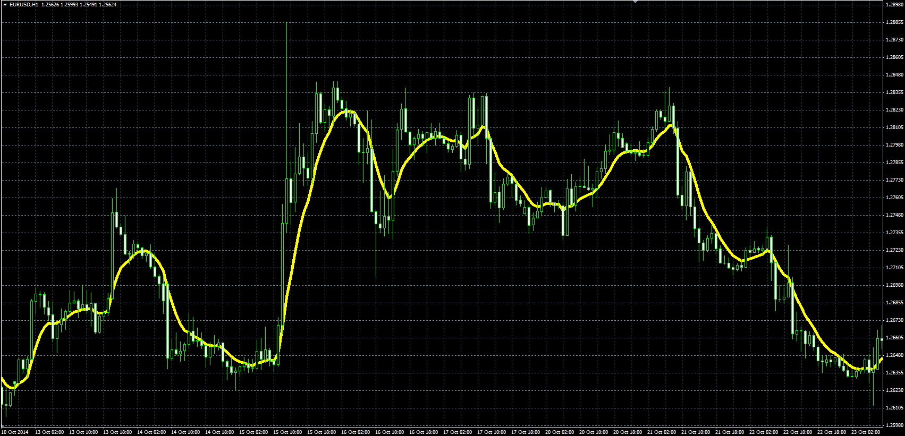

# Power weighted moving average (PWMA)

> Source: https://fxcodebase.com/code/viewtopic.php?f=38&t=61506  
> Forum: 38 · Topic 61506 · 1 post(s)

---

## Power weighted moving average (PWMA)

**Alexander.Gettinger** · Thu Nov 20, 2014 6:06 pm

Formula:
PWMA = SUM(Price(i)*(i^Power), Length)/SUM(i^Power, Length).

For Power=1 PWMA is identical to Linear Weighted Moving Average (LWMA).

 

Download:

 [PWMA.mq4](files/97245/PWMA.mq4)
