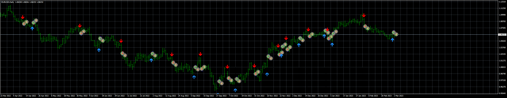

# Pract_EA

> Source: https://fxcodebase.com/code/viewtopic.php?f=38&t=73453  
> Forum: 38 · Topic 73453 · 7 post(s)

---

## Pract_EA

**Apprentice** · Sun Mar 05, 2023 5:35 pm

Based on the request.
[https://fxcodebase.com/code/viewtopic.php?f=27&p=149766](https://fxcodebase.com/code/viewtopic.php?f=27&p=149766)

 [Pract_Indicator.mq4](files/149868/Pract_Indicator.mq4)

 [Pract_EA_v1.00.mq4](files/149868/Pract_EA_v1.00.mq4)

---

## Re: Pract_EA

**Sensible** · Mon Mar 06, 2023 8:24 am

Hi Apprentice,

I really appreciate the approval and development of this EA. Thanks

I have some correction with this EA after testing it on Mq4 Strategy tester.

Firstly, Open Positions at: Immediately is not working although the after candle close and rest are working but it resulting to loss. I prefer it to Open Buy and Sell immediately the arrow appear not after a candle close because it doesn't repaint, so immediately will work fine in open buy and sell.

Secondly, The Trailing Stop and BreakEven is not working for Open Sell trade But it only working for Open Buy only. Please help me to make it to work for Sell too.

Looking forward to this correction Sir. Thanks alot.

---

## Re: Pract_EA

**Sensible** · Tue Mar 07, 2023 8:22 am

Good day,

 So sooorry for sending another message.

On the issue of Trailing Stop and BreakEven not working on Sell side I have discovered where I am making the mistake it now working on both side. the error is from me.

On the Opening of Position, I want it to Open position immediately arrow signal appear either for buy or sell not after a candle close because after a candle close is resulting to loss when quick signal appear.

Please let the Open Position work on immediately not after candle close. That is the only correction remaining.

Thank you

---

## Re: Pract_EA

**Apprentice** · Sat Mar 11, 2023 4:39 am

We have added your request to the development list.
Development reference 236.

---

## Re: Pract_EA

**Sensible** · Sun Mar 19, 2023 8:05 pm

Hi Apprentice,

I am still waiting for the correction on this EA

On the Opening of Position, I want it to Open position immediately arrow signal appear either for buy or sell not after a candle close because after a candle close is resulting to loss when opposite quick signal appear.

Please let the Open Position work on immediately not after candle close.

Thanks.

---

## Re: Pract_EA

**Sensible** · Mon Apr 03, 2023 10:28 am

> **Sensible wrote:**
> Hi Apprentice,
>
> I am still waiting for the correction on this EA
>
> On the Opening of Position, I want it to Open position immediately arrow signal appear either for buy or sell not after a candle close because after a candle close is resulting to loss when opposite quick signal appear.
>
>
> Please let the Open Position work on immediately not after candle close.
>
> Thanks.

Any update on the correction request

---

## Re: Pract_EA

**Apprentice** · Sat Apr 15, 2023 4:04 am

I checked the base indicator and it calculates from the first closed bar: for(int i=limit; i>0; i--)

I tried to move the calculation from the forming bar but in this case the indicator show too many false signals.
