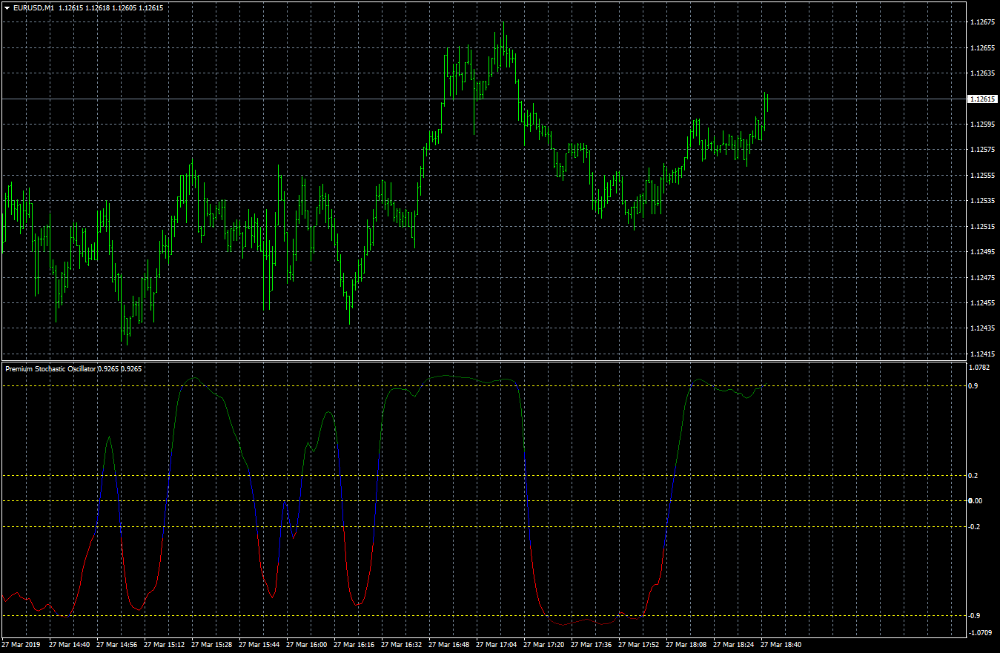

# Premium Stochastic Oscillator

> Source: https://fxcodebase.com/code/viewtopic.php?f=38&t=68181  
> Forum: 38 · Topic 68181 · 4 post(s)

---

## Premium Stochastic Oscillator

**Apprentice** · Wed Mar 27, 2019 3:38 pm

Based on request.
[viewtopic.php?f=27&t=68172](https://fxcodebase.com/code/viewtopic.php?f=27&t=68172)

 [Premium Stochastic Oscillator.mq4](files/125373/Premium%20Stochastic%20Oscillator.mq4)

---

## Re: Premium Stochastic Oscillator

**Tomaszo** · Thu Sep 16, 2021 12:03 pm

Hello, i found something that could be interesting and it would be nice if you could make an arrow to it. I saw that sometimes the line is blue in oversold or overbought and that situation is very accurate to reverse. Could you make an arrow when this stochastic is in os or ob zone and the line is blue?

---

## Re: Premium Stochastic Oscillator

**Apprentice** · Thu Sep 16, 2021 1:30 pm

Your request is added to the development list.
Development reference 835.

---

## Re: Premium Stochastic Oscillator

**Apprentice** · Wed Sep 22, 2021 3:47 am

[Premium_Stochastic_Oscillator.mq4](files/143702/Premium_Stochastic_Oscillator.mq4)

Try this version.
