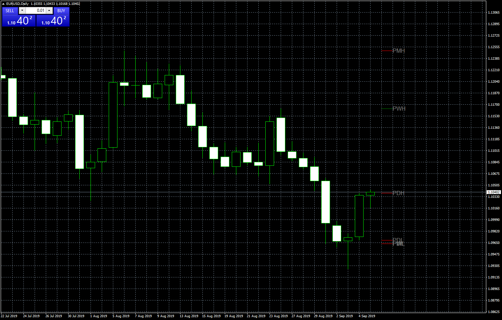

# Previous High Low

> Source: https://fxcodebase.com/code/viewtopic.php?f=38&t=68884  
> Forum: 38 · Topic 68884 · 11 post(s)

---

## Previous High Low

**Apprentice** · Thu Sep 05, 2019 4:55 am

Based on request.
[viewtopic.php?f=27&t=68845](https://fxcodebase.com/code/viewtopic.php?f=27&t=68845)

 [Previous High Low.mq4](files/128423/Previous%20High%20Low.mq4)

---

## Re: Previous High Low

**TheGMan** · Fri Sep 06, 2019 6:59 am

> **Apprentice wrote:**
>
>
> The attachment **eurusd-d1-forex-capital-markets.png** is no longer available
>
>
> Based on request.
> [viewtopic.php?f=27&t=68845](https://fxcodebase.com/code/viewtopic.php?f=27&t=68845)
>
>
> The attachment **eurusd-d1-forex-capital-markets.png** is no longer available

Thanks, Apprentice everything looks great!

Only 2 things that I ask....

1) When I set the previous day lines color to Aqua it also shows Aqua for the monthly lines when actually I have Monthly set to Yellow. Can it be corrected?

(See attached screenshot)

2nd) Could you please add an input for Previous high/low for the Previous Year?

Thank you so much! You guys do a Great Job!

G

---

## Re: Previous High Low

**Apprentice** · Sat Sep 07, 2019 5:40 am

Your request is added to the development list.
Development reference 47.

---

## Re: Previous High Low

**TheGMan** · Fri Sep 13, 2019 7:56 pm

> **Apprentice wrote:**
> Try this version.
>
>
> The attachment **Previous High Low.mq4** is no longer available

Hi Apprentice

First I want to thank you for correcting the colors glitch & for also adding the Previous Year High/Low option, this is great!

The problem I am having is that my lines appear very short & small on my charts (Please see 1st screenshot)

If it is not asking too much could you please just make the lines & the text appear like what is on this 2nd screenshot so that they appear just like the Pivot Points do on this chart? Please add the previous H/L text centered below the lines as the pivots indicator shows.

Also one last request for this indicator...In my original request I had asked for an option to be able to move the lines & text to the right or to the left a bit if need be. Can you please add this option in the inputs?

Thanks again for all you do!!!

Have an awesome weekend!

G

---

## Re: Previous High Low

**Apprentice** · Mon Sep 16, 2019 3:41 am

Your request is added to the development list.
Development reference 93.

---

## Re: Previous High Low

**TheGMan** · Mon Sep 16, 2019 10:22 pm

> **Apprentice wrote:**
>
>
> Previous_High_Low.mq4
>
>
> Try this version.

Hi Apprentice

This version works much better for me.

Thanks again for all that you & the other coders do!

G

---

## Re: Previous High Low

**TheGMan** · Tue Sep 17, 2019 5:11 pm

Hi Apprentice,

Something going on with the Previous Year High/Low lines & text not lining up properly. This is a screenshot of Gold but I get the same thing happening on the currency pairs as well.

Could it be looked at?

Thanks!

G

---

## Re: Previous High Low

**Apprentice** · Wed Sep 18, 2019 6:40 am

Your request is added to the development list.
Development reference 102.

---

## Re: Previous High Low

**TheGMan** · Thu Sep 19, 2019 8:43 pm

> **Apprentice wrote:**
> Try this version.
>
>
> The attachment **Previous_High_Low.mq4** is no longer available

Hi Apprentice,

Thank you for your effort, however, there is still a challenge with these Previous Year H/L Levels.

(Please see the attached 2 screenshots.)

Both screenshots are on W1 TF. You will see in screenshot 1 it appears that when the indicator is 1st added to the chart the Previous Year lines are at the correct levels/Price but as soon as you get the very next tic from the data feed the upper line drops down to where you see it then in the 2nd screenshot.

Strange indeed.

Thank you
G

---

## Re: Previous High Low

**Apprentice** · Wed Oct 02, 2019 4:40 am

[Previous_High_Low.mq4](files/128949/Previous_High_Low.mq4)

Try this version.

---

## Re: Previous High Low

**TheGMan** · Thu Oct 03, 2019 12:48 am

> **Apprentice wrote:**
>
>
> Previous_High_Low.mq4
>
>
> Try this version.

This one seems to be working much better now.

Thank you, Apprentice!

G
