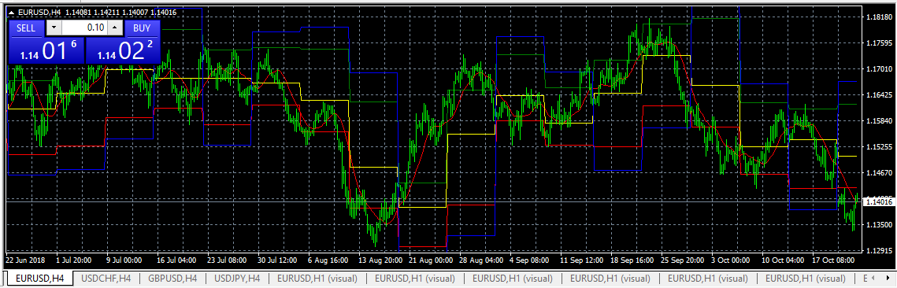

# Previous Week High-Low

> Source: https://fxcodebase.com/code/viewtopic.php?f=38&t=66866  
> Forum: 38 · Topic 66866 · 3 post(s)

---

## Previous Week High-Low

**Apprentice** · Sun Oct 28, 2018 8:04 am

Based on request.
[viewtopic.php?f=17&t=66859](https://fxcodebase.com/code/viewtopic.php?f=17&t=66859)

 [Previous Week High-Low Fibo indi.mq4](files/121817/Previous%20Week%20High-Low%20Fibo%20indi.mq4)

 [Previous Week High-Low Fibo EA.mq4](files/121817/Previous%20Week%20High-Low%20Fibo%20EA.mq4)

TS2/Lua version.
[viewtopic.php?f=17&t=66863&p=121813#p121813](https://fxcodebase.com/code/viewtopic.php?f=17&t=66863&p=121813#p121813)

---

## Re: Previous Week High-Low

**Stomp2k** · Sun Oct 28, 2018 12:05 pm

indi not painting on chart, I will retry at market opening on 1028
Thanks

---

## Re: Previous Week High-Low

**Apprentice** · Mon Oct 29, 2018 5:17 am

The issue has been verified.
We are investigating the problem.
Will it become updates here.
