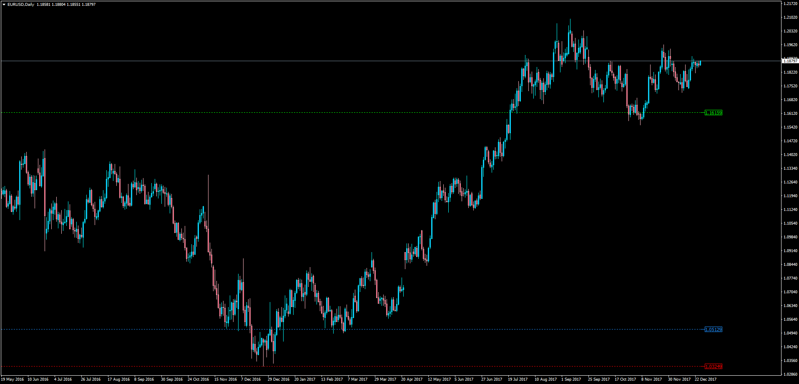
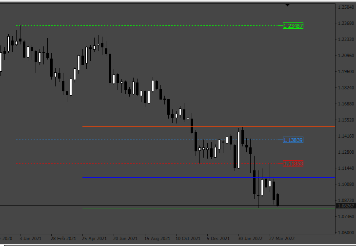

# Previous Year HLC

> Source: https://fxcodebase.com/code/viewtopic.php?f=38&t=65485  
> Forum: 38 · Topic 65485 · 7 post(s)

---

## Previous Year HLC

**Apprentice** · Wed Dec 27, 2017 4:07 pm

LUA Original: [viewtopic.php?f=17&t=63105](https://fxcodebase.com/code/viewtopic.php?f=17&t=63105)

Description:

This MT4 version of the LUA Original performs a calculation of the previous year's high, low and close and display these lines accross the chart until the current candle.

 [Previous_Year_HLC.mq4](files/116642/Previous_Year_HLC.mq4)

 [LastYearPrice.mq5](files/116642/LastYearPrice.mq5)

---

## Re: Previous Year HLC

**Godwin** · Tue Apr 05, 2022 10:32 am

Good day.
Can we get Previous Quarter High Low and Close (Previous HLC) of this indicator.
Thank you

---

## Re: Previous Year HLC

**Apprentice** · Wed Apr 06, 2022 9:50 am

Your request is added to the development list.
Development reference 210.

---

## Re: Previous Year HLC

**Apprentice** · Wed Apr 13, 2022 11:57 am

 [Previous_Year_HLC.mq4](files/145674/Previous_Year_HLC.mq4)

---

## Re: Previous Year HLC

**jacryptoking** · Fri Apr 29, 2022 3:55 am

> **Apprentice wrote:**
>
>
> indi210.png
>
>
>
>
> Previous_Year_HLC.mq4

Can you convert this indicator to Mql5 file please?

---

## Re: Previous Year HLC

**Apprentice** · Mon May 02, 2022 8:43 am

We have added your request to the development list.
Development reference 270.

---

## Re: Previous Year HLC

**Apprentice** · Tue Jun 28, 2022 3:37 pm

LastYearPrice.mq5 aded.
