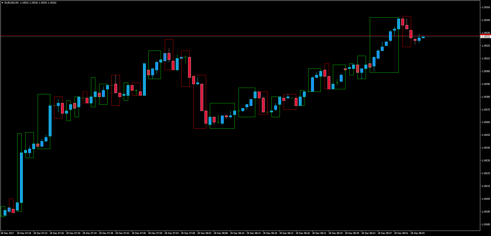
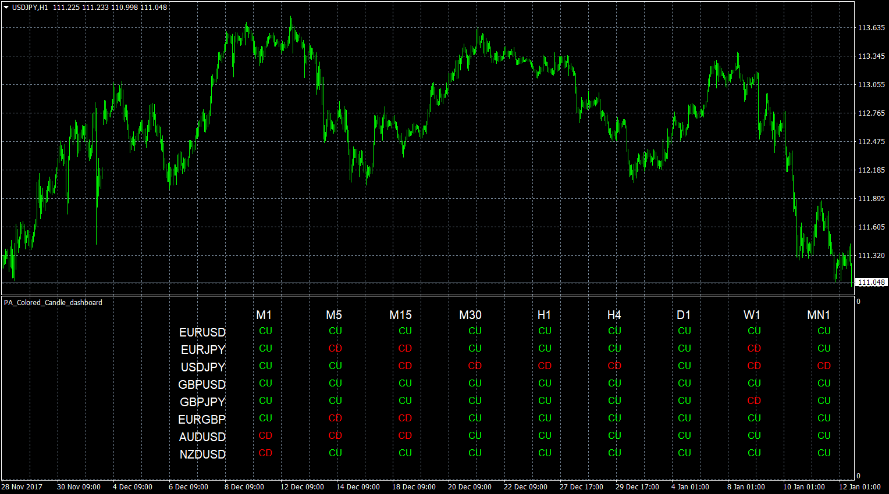

# Price Action Colored Candle

> Source: https://fxcodebase.com/code/viewtopic.php?f=38&t=65487  
> Forum: 38 · Topic 65487 · 7 post(s)

---

## Price Action Colored Candle

**Apprentice** · Thu Dec 28, 2017 6:33 am

LUA Original:

Description: [viewtopic.php?f=17&t=64452](https://fxcodebase.com/code/viewtopic.php?f=17&t=64452)

This is the MT4 version of the LUA original indicator where the following condition is required:

Bullish Box: Current Close is higher than Previous Low.

Viceversa for Bearish.

 [PA_Colored_Candle.mq4](files/116646/PA_Colored_Candle.mq4)

 [PA_Colored_Candle_mtf.mq4](files/116646/PA_Colored_Candle_mtf.mq4)

 

 [PA_Colored_Candle_dashboard.mq4](files/116646/PA_Colored_Candle_dashboard.mq4)

---

## Re: Price Action Colored Candle

**kolikol** · Mon Jan 08, 2018 10:17 pm

MTF version aviable?

---

## Re: Price Action Colored Candle

**Apprentice** · Thu Jan 11, 2018 7:47 am

Your request is added to the development list under Id Number 4004

---

## Re: Price Action Colored Candle

**Apprentice** · Fri Jan 12, 2018 6:34 am

Something like PA_Colored_Candle_dashboard.mq4?
Or your idea was PA_Colored_Candle with time frame selector?

---

## Re: Price Action Colored Candle

**kolikol** · Sun Jan 14, 2018 11:34 pm

Yes, my idea is PA_Colored_Candle with time frame selector.

---

## Re: Price Action Colored Candle

**Apprentice** · Mon Jan 15, 2018 8:36 am

PA_Colored_Candle_mtf.mq4 added.

---

## Re: Price Action Colored Candle

**kolikol** · Wed Jan 17, 2018 9:32 pm

Thank you very much.
