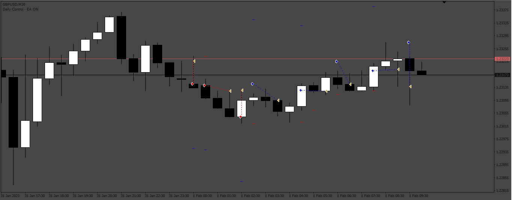
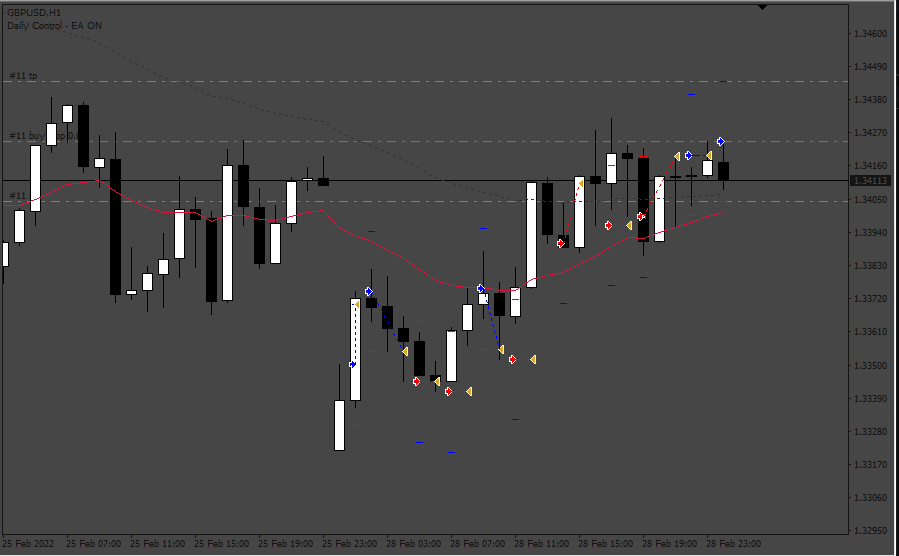
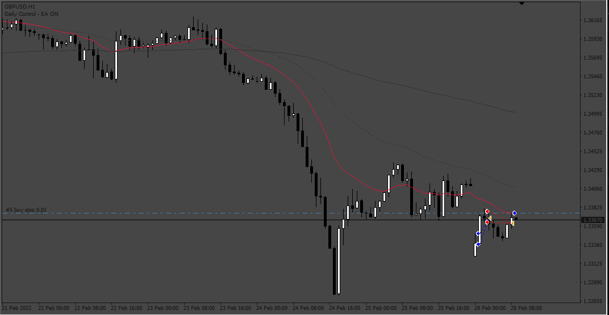

# Price_Action_EA

> Source: https://fxcodebase.com/code/viewtopic.php?f=38&t=73915  
> Forum: 38 · Topic 73915 · 11 post(s)

---

## Price_Action_EA

**Apprentice** · Tue Jul 11, 2023 2:50 am

Based on the request.
[https://fxcodebase.com/code/viewtopic.php?f=27&p=151516](https://fxcodebase.com/code/viewtopic.php?f=27&p=151516)

 [Price_Action_EA.mq4](files/151593/Price_Action_EA.mq4)

---

## Re: Price_Action_EA

**meqdad77brz** · Wed Jan 24, 2024 10:16 am

Thanks a lot to FxCodeBase Team and also Dear Mario Jemic ,

very Nice EA and may be so profitable , but has some bugs I explain them :

1. It is better to works only with pending orders and not the market execution
1-2. (Pending orders option in this version doesn't work correctly)
1-3. (Pay attention : Pendings should be deleted if they are not activated in the next candle)

2. Trades should be open on High and Low of previous candle (and not the Open and Close)

3. The EA should be working out of the input Time
(input time is only for opening an order and the EA could modifying it any time)

Thanks a lot again , and I wish you all the best

---

## Re: Price_Action_EA

**Apprentice** · Thu Jan 25, 2024 3:20 pm

We have added your request to the development list.
Development reference 104

---

## Re: Price_Action_EA

**Apprentice** · Thu Feb 01, 2024 1:45 pm

 [Price_Action_EA_v2.mq4](files/154246/Price_Action_EA_v2.mq4)

---

## Re: Price_Action_EA

**Appu264** · Fri Feb 02, 2024 8:14 am

SIR PLEASE
ADD A HEDGING FOR NO LOSE IF PRICE GOES OPPOSITE SITE AND BOOK OVER ALL ON PROFIT

---

## Re: Price_Action_EA

**Apprentice** · Tue Feb 06, 2024 12:06 pm

We have added your request to the development list.
Development reference 119

---

## Re: Price_Action_EA

**Apprentice** · Sat Feb 10, 2024 11:38 am

 [Price_Action_EA_v3.mq4](files/154345/Price_Action_EA_v3.mq4)

---

## Re: Price_Action_EA

**andrewtrading** · Fri Jun 27, 2025 9:50 am

Can you make it so that if grid is active and there is an open position e.g. BUY all subsequent buy positions become averages with a single take profit approaching each average and vice versa for sells?- First signal Buy/Sell normal TP
- Next Buy/Sell signals mediation with whole TP, Until close the block of positions reached the overall TP or basket grid Profit for each direction trade

---

## Re: Price_Action_EA

**andrewtrading** · Fri Jun 27, 2025 10:37 am

FIX:

---

## Re: Price_Action_EA

**Apprentice** · Wed Jul 02, 2025 2:44 pm

We have added your request to the development list.
Development reference 434

---

## Re: Price_Action_EA

**Apprentice** · Mon Jul 07, 2025 4:22 pm

[Price_Action_EA_v3.mq4](files/159855/Price_Action_EA_v3.mq4)

Try this version.
